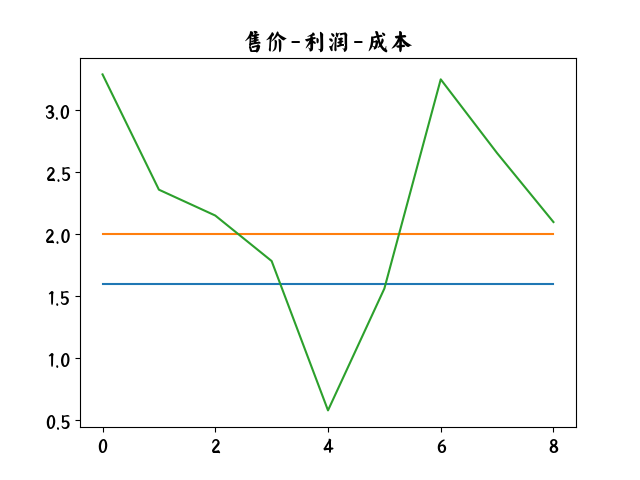

 
  
# 资本论 &#183; 政治经济学批判
  
##第三卷
  
##资本主义生产的总过程（上）

    
    
    
    
    
卡尔$\cdot$马克思 著 
 恩格斯 编

  
  

## 序言
- 马克思的主要著作的第三卷, 理论部分的终结
- 当1885年第二卷出版的时候,我曾以为, 第三卷的困难大概只是技术性的
- 首先而且主要妨碍我的,是长期视力衰退
- 这些先生们根本就不是真正的理论家, 而只是反动派的辩护士。
> 一个人过了七十岁,大脑中的迈内尔特联想纤维工作起来
迟钝得令人讨厌, 要克服困难的理论工作上的中断造成的影响, 再
也不象以前那样容易那样迅速了。因此, 一个冬天的工作要是没有
完成, 到下一个冬天很大部分只好重新做起。这种情况, 特别发生
在困难最多的第五篇
- 第三卷只有一个初稿, 而且极不完全
- 主要的困难在第五篇。 那里讨论的也是全卷最复杂的问题。 正
当马克思写这一篇时, 上面提到的重病又一次发作了
- 第四卷—— 剩余价值理论史 ,只要有可能,我就着手去编。
- 资本家期望按照自己资本的量的比例来取得相等的利润, 因而把他们预付的资本看作是他们利润的一种成本价格, 这是大家知道的
- 竞争是利润平均化的重大原因这种看法, 并不是什么新东西
- 这是出自他的误解, 即认为马克思进行阐述的地
方, 就是马克思要下的定义, 并认为人们可以到马克思的著作中去
找一些不变的、现成的、 永远适用的定义
- 在我来往的世界里, 人们是不需要干这种卑鄙的勾当的。
>一个人如想研究科学问题, 首先要在利用著
作的时候学会按照作者写的原样去阅读这些著作, 首先要在阅读
时, 不把著作中原来没有的东西塞进去

## 第一篇：剩余价值转化为利润
## 和剩余价值率转化为利润率
### 第一章 成本价格和利润
- 资本主义生产过程, 就整体来看,是生产过程和流通过程的统一
- 从资本主义生产的观点来看, 这个实际的情况必然以颠倒的形式表现出来
- 商品的成本价格仅仅是由商品的生产上实际耗费的资本构成的
- 超过成本价格的余额或剩余价值
- 剩余价值不仅对进入价值增殖过程的预付资本部分来说是一个增加额, 而且对不进入价值增殖过程的预付资本部分来说也是一个增加额
- 剩余价值是同时由所使用的资本的一切部分产生的
- 商品价值=成本价格+利润
- 商品出售价格的最低界限,是由商品的成本价格规定的
- 在资本主义生产占统治地位的社会内, 非资本主义的生产者也受资本主义观念的支配

### 第二章 利润率
- 一个价值额投入流通,是为了从流通中取出一个更大的价值额。 这个更大价值额的产生过程,是资本主义的生产;这个更大价值额的实现过程,是资本的流通
- 正是非劳动者对这种生产资料的占有, 使劳动者变成雇佣工人, 使非劳动者变成资本家
- 商品包含的价值, 等于制造商品所耗费的劳动时间, 这个劳动的总和则由有酬劳动和无酬劳动构成
$$利润率=\frac{利润[剩余价值]}{总成本}$$
- 实际上, 利润率从历史上说也是出发点。剩余价
值和剩余价值率相对地说是看不见的东西,是要通过研究加以揭
示的本质的东西。利润率, 从而剩余价值的形式即利润, 却会在现
象的表面上显示出来
- 虽然商品价值超过它的成本价格的余额是在直接生产过程中
产生的, 但它只是在流通过程中才得到实现
- 对**单个资本家**来说, 由他本人实现的剩余价值, 既取决
于对劳动的直接剥削, 也取决于互相诈骗的行为
- 一方面, 价值, 即**支配着活劳动的过去劳动**, 人格化为资本
家; 另一方面, 工人反而仅仅表现为物质劳动力,表现为商品

### 第三章 利润率和剩余价值率的关系
- 这个剩余价值一方面分成各种派生形式, 即资本利息、 地租、赋税等等
- 工资的增加会减少剩余价值, 而工作日的延长和劳动强度的提高则会增加剩余价值
- 分情况讨论跳过
- 结论:
>剩余价值率降低或者提高,利润率可以提高;剩余价值率提高或者降低,利润率可以降低;剩余价值率提高或者降低,利润率可以不变
- 利润率取决于两个主要因素: 剩余价值率和资本的价值构成。

### 第四章 周转对利润率的影响
- 缩短生产时间的主要方法是提高劳动生产率, 这就是人们通常所说的工业进步
- 缩短流通时间的主要方法是改进交通。
- 投在一个企业中的可变资本究竟有多大,在绝大多数场合, 连资本家自己也不知道

### 第五章 不变资本使用上的节约
- 这种由生产资料的集中及其大规模应用而产生的全部
节约,是以工人的聚集和共同工作, 即劳动的社会结合这一重要条
件为前提的
- 由于大规模社会劳动所产生的废料数量很大,
这些废料本身才重新成为商业的对象, 从而成为新的生产要素
- 商品的便宜程度, 取决于它作为产品生产
出来的生产部门的劳动生产率
- 资本的再生产和积累, 更多地取决于所
使用的劳动的生产率, 而不是所使用的劳动量
- 资本家狂热地节约生产资料是可以理解的,要做到一点
也不损失, 一点也不浪费, 这部分地取决于工人的训练和教育, 部分地取决于资本家强加给结合工人的纪律。这种纪律在工人为自己的利益而劳动的社会状态中是多余的
- 因为剩余价值率本质上取决于劳动力的价值, 也就是取决于工人日常生活资料的价值
- , 因为**大规模生产**首先是在资本主义形式上发展起来的,
所以, 一方面是疯狂追求利润的欲望, 另一方面是迫使人们尽可能便宜地生产商品的竞争
- 工人的一生绝大部分时间都是在生产过程中度过的, 所
以, 生产过程的条件大部分也就是工人的能动生活过程的条件,是
工人的生活条件
- **过度劳动** ,把工人变成一种**役畜**,是加速资本自行增殖, 加速剩余价值生产的一种方法
- 资本主义生产尽管非常吝啬,但对人身材料却非常浪费
- 资本主义生产一方面使社会失去的东西, 就是另一方面使单个资本家获得的东西
>他们留在伦敦不
过是暂时的;如果这个期间他们得了病, 他们就回到农村的家里
去, 如果死了, 就在那里进行死亡登记。 就年纪较轻的工人来说, 情
况更是如此
- 原料的日益昂贵,自然成为废物利用的刺激
- **一般劳动** 是一切科学工作, 一切发现, 一切发明
>.
经营一个建立在新发明基础上的工厂所需要的费用, 同后
来在它的废墟上,在它的遗骸上出现的工厂相比, 要大得多。这种
现象如此普遍, 以致最初的企业家大都遭到破产, 而后来用比较便
宜的价格买到建筑物、 机器等等的人才兴旺起来。因此, 从人类精
神的一般劳动的一切新发展中, 以及这种新发展通过结合劳动所
取得的社会应用中, 获得最大利润的,大多都是最无用和最可鄙的
货币资本家。

### 第六章 价格变动的影响
- 刚才研究的可变资本的游离和束缚,是可变资本各种要素即
劳动力再生产费用的贬值和增值的结果
- 在这里, 撇开工
资, 也就是撇开可变资本不说, 对一切部门来说, 最重要的要素就
是原料, 包括辅助材料在内
- 剧烈的价格波动, 会在再生产过程中引起中断, 巨大的冲突, 甚至灾
- **合理的农业**所需要的, 要么是自食其力的**小农的手**, 要么是**联合起来的生产者**的控制。
- 资本主义制度同合理的农业相矛盾, 或者说, 合理的农业同资本主义制度不相容
- 整个资产阶级的眼睛都盯着工人

### 第七章 补充说明
>假定劳动的剥削程度相同,正如我们已经看到的, 撇开信用
制度所引起的一切变化, 撇开资本家互相间的各种欺骗和诈取, 再
撇开对市场的任何一种有利的选择, 利润率仍然可以有很大的差
别, 这取决于原料的贵贱, 购买原料的人的内行程度; 取决于所使
用的机器的生产效率、 适用程度和便宜程度; 取决于生产过程各个
阶段的总安排的完善程度, 即原料的浪费是否被杜绝, 指挥和监督
是否简单而有效, 等等。
	
- 会提供多大的利润量,在很大的程度上还要取决于资本家自己或他的经理和职员个人的经营本领
- 每一种商品 (因而也包括构成资本的那些商
品)的价值, 都不是由这种商品本身包含的必要劳动时间决定的,
而是由它的再生产所需要的社会必要劳动时间决定的

## 第二篇 利润转化成平均利润

###第八章 不同生产部门的资本的不同构成和由此引起的利润率的差别
- 工资水平的差别:简单劳动和复杂劳动的差别为基础的
- 这些差别虽然会使不同生产部门的工人的命运
很不一样, 但决不会影响这些不同部门的劳动剥削程度
- 我们在这一篇中要说明的恰恰是, 一般利润率在一个国家内是通过什么方式形成的
- 一定量的已经物化在生产资料中的劳动, 必须有一定量的活劳动
与之相适应。 这个比率在不同的生产部门是极不相同的, 甚至在同
一个产业的不同部门, 也往往是极不相同的,
- 个非常重要的区别:一方面,它的价值,即工资额,代表着一定
量物化劳动;另一方面,它的价值只是它所推动的活劳动量的指
数。 它所推动的活劳动量, 总是大于它所包含的劳动量,
- 剩余价值的唯一源泉是活劳动
- 各国的不同的利润率,大都是以各国的不同的剩
余价值率为基础的
- 对利润率来说,起决定作用的,是可变资本和不变资本之比
- 不管所生产的价值和剩余价值多么不同, 成本价格对投在不同部门的等量资本来说总是一样的。 成本价格的这种等同性, 形成不同投资竞争的基础, 而平均利润就是通过这种**竞争**确定的。

###第九章 一般利润率(平均利润率)的形成和商品价值转化为生产价格
- 如果把社会当作一切生产部门的总体来看, 社会本身所生产的商品的生产价格的总和等于它们的价值的总和
- 一个产业部门的利润会加入另一个产业部门的成本价格
- 谁也不会把自己的利润算到自己的成本价格中
>总的说来,在整个资本主
义生产中, 一般规律作为一种占统治地位的趋势, 始终只是以一种
极其错综复杂和近似的方式, 作为从不断波动中得出的、 但永远不
能确定的平均情况来发生作用。
- 在一般利润率的形成上,不
仅要考虑到不同生产部门利润率的差别, 求出它们的简单平均数,
而且还要考虑到不同利润率在平均数形成上所占的比重
- 我们把那种同社会平均资本相比, 不变资本占的百分比高, 从而可变资本占的百分比低的资本, 叫作**高构成的资本**。
- 反之,把那种同社会平均资本相比, 不变资本比重小, 而可变资本比重大的资本, 叫作**低构成的资本**。
- 最后,我们把那种和社会平均资本有同样构成的资本, 叫作**平均构成的资本**
- 无论如何, 商品的成本价格总是小于商品的价值这个论点,在这里仍然是正确的
- 商品的成本价格,只是涉及商品中包含的有酬劳动的量;
- 价值,是涉及商品中包含的有酬劳动和无酬劳动的总量
- 因为利润率是资本家实际上唯一关心的事情
- 量的差别只存在于剩余价值率和利润率之间, 而不是存在于剩余价值和利润本身之间
- 节省劳动——不仅指节省生产某种产品所必需的劳动, 而且也指节省所雇用的工人人数—— 和更多地使用死劳动
- 因为可变资本是剩余价值的源泉
- **商品价值由其中包含的劳动决定**

###第十章 一般利润率通过竞争而平均化,市场价格和市场价值,超额利润
- 所以一切资本,
不管它们本身生产多少剩余价值, 都力求通过它们的商品的价格
来实现平均利润, 而不是实现这个剩余价值, 也就是说, 力求实现
生产价格。
- 真正困难的问题是: 利润到一般利润率的这种平均化
是怎样进行的, 因为这种平均化显然是结果, 而不可能是起点
- 商品不只是当作商品来交换, 而是当作资本的产品来交换。 这些资本要求从剩余价值的总量中,分到和它们各自的量成比例的一份, 或者在它们的量相等时, 要求分到相等的一份
- 按照它们的生产价格进行的交换, 则需要资本主义的发展达到一定的高度
- 价值规律支配着价格的运动, 生产上所需要的劳动时间的减少或增加, 会使生产价格降低或提高
>竞争首先在一个部门内实现的,是使商品的各种不同的个别
价值形成一个相同的市场价值和市场价格。但只有不同部门的资
本的竞争,才能形成那种使不同部门之间的利润率平均化的生产
价格。这后一过程同前一过程相比,要求资本主义生产方式发展
到更高的水平
- "社会需要", 本质上是由不同阶级的互相关系和它们各自的经济地位决定的
- 说商品有使用价值, 无非就是说它能满足某种社会需要
- 如果这个量小于或大于对它的需求, 市场价格就会偏离市场价值
- 要给需求和供给这两个概念下一般的定义, 真正的困难在于,它们好象只是同义反复
- 商品按照它们的价值来交换或出售是理所当然的,是商品平衡的自然规律
- 商品被买来当作生产资料或生活资料, 以便进入生产消费或个人消费
- 工人阶级要维持通常的中等水平的生活,至少必须再得到同样数量的必要生活资料
- 如果考虑到人口每年在增长, 那就还要有必要生活资料的追加量
- 从量的规定性来说, 这种 **需要** 具有很大伸缩性和变动性
- 一方面是实际需要的商品量; 另一方面是商品的货币价格发生变化时所需要的商品量
- 真正的困难在于确定, 供求一致究竟是指什么
- 资本主义生产的实际的内在规律, 显然不能由供求的互相作用来说明
- 因为这种规律只有在供求不再发生作用时, 也就是互相一致时, 才纯粹地实现。供求实际上从来不会一致
- 除了价格由供求决定而同时供求又由价格决定这种混乱观点之外, 还要加上: 需求决定供给, 反过来供给决定需求, 生产决定市场, 市场决定生产
- 竞争显示出生产和消费的**社会**性质
- 只有各方通过共同行动比没有共同行动可以得到更多好处, 他们才会关心共同行动
- 供求以价值转化为市场价值为前提
- 资本就意识到自己是一种社会权力; 每个资本家都按照他在社会总资本中占有的份额而分享这种权力
- 资本会从利润率较低的部门抽走, 投入利润率较高的其他部门
- 那种在不断的不平衡中不断实现的平均化,在下述两个条件下会进行得更快: 1.资本有更大的活动性;2.劳动力能够更迅速地从一个部门转移到另一个部门,从一个生产地点转移到另一个生产地点。
- 工人对于自己劳
动的内容是无所谓的;一切生产部门的劳动都已最大限度地化为
简单劳动;工人抛弃了一切职业的偏见;最后,特别是工人受资
本主义生产方式的支配
- 不同的生产部门都受资本家支配
- 或者通过例外的过度劳动, 或者通过把工资降低到
平均工资以下的办法, 或者通过所使用的劳动的额外生产率, 可以
获得一种额外利润, 即超出平均利润的利润
- 超额利润还能在下列情况下产生出来: 某些生产部门可
以不把它们的商品价值转化为生产价格, 从而不把它们的利润化
为平均利润。{地租}

### 第十一章 工资的一般变动对生产价格的影响
- 我们看到,只要按相反的方向重述以上的说明并加上必要的修改就行了
- 问题只是, 工资的一般提高或降低怎样影响被假设为既定的商品生产价格
- 
### 第十二章 补充说明
- 一个商品的生产价格发生变化,只能由于两个原因
	- 一般利润率发生变化
	- 一般利润率保持不变。这时, 一个商品的生产价格能够
变动,只是因为它本身的价值已经变动
- 商品生产价格的一切变动最终都可以归结为价值的变动, 但
并不是商品价值的一切变动都要表现为生产价格的变动
- 在一切情况下,工资的提高或降低决不会影响商品的价值,而总是只会影响剩余价值的量
>竞争使不同生产部门的利润率平均化为平均
利润率, 并由此使这些不同部门的产品的价值转化为生产价格。 而
这是通过资本从一个部门不断地转移到利润暂时高于平均利润的
另一个部门来实现的
- 如果在一个时期利润特别高, 那末在另一个时期利润就会特别低, 甚至会亏损
- 商人资本能够非常迅速地把大量资本从一个营业部门抽走, 并且同样迅速地把它投入另一个营业部门
- **竞争**所没有表明的,是支配着生产运动的价值规定,是在生产价格背后的、 归根到底决定生产价格的价值
- 在竞争中一切都颠倒地表现出来
- 基本观念是平均利润本身,是等量资本必须在相同时间内提供等量利润
- 一旦资本主义生产和与之相连的保险事业发展起来, 风险对一切生产部门来说实际上都一样了

## 第三篇 利润率趋向下降的规律

###第十三章 规律本身
- 在劳动的剥削程度不变时, 同一个剩余价值率会表现为不断下降的利润率
- 在剩余价值率不变或资本对劳动的剥削程度不变的情况下, 一般利润率会逐渐下降
>资本主义生产, 随着可变资本同
不变资本相比的日益相对减少, 使总资本的有机构成不断提高, 由
此产生的直接结果是: 在劳动剥削程度不变甚至提高时, 剩余价值
率会表现为一个不断下降的一般利润率。
- 利息只是说明高利贷按什么比率占有地租
- 一定量的社会平均资本表现为劳动资料的部分越来越大,表现为活劳动的部分越来越小。
- 利润率的下降,不是由于总资本的可变组成部分的绝对减少,而只是由于它的相对减少,由于它同不变组成部分相比的减少
- 利润只是按社会资本计算的剩余价值
- 资本主义生产过程实质上同时就是积累过程
- 资本的积累本身以及随之而来的资本积聚, 本身就是提高**生产力**的一个物质手段
- 剩余资本暂时超过它所支配的工人人口, 这会发生双重的作用。
	-  一方面, 这会提高工资, 从而缓和那些使工人后代减少和绝灭的影响, 使结婚变得容易, 由此使工人人口逐渐增加。
	-  另一方面, 这会使创造相对剩余价值的方法(机器的采用和改良) 得到采用, 由此更迅速得多地创造出人为的相对过剩人口
- 在资本主义生产中, 贫困会产生人口
- 资本主义生产和积累的发展, 要求劳动过程的规模及其范围日益扩大, 要求每一个企业的预付资本相应地日益增加。因此, 日益增长的资本积聚
- 社会劳动生产力的发展, 即表现为可变资本同总资本相比相对减少和积累由此加速的那些规律
- 资本的不断增加和它对不断增加的人口的需要的相对减少之间的不协调
- 随着劳动的社会生产力的发展, 为了推动同量的
劳动力和吸收同量的剩余劳动, 所需要的总资本量越来越大。因
此, 工人人口相对过剩的可能性随着资本主义生产的发展而同样
地发展起来
- 一个拥有巨额资本的资本家所赚得的利润量,大于一个表面上赚得高额利润的小资本家所赚得的利润量
- 资本所生产的商品的价格下降, 同时商品所包含的并通过商品出售所实现的利润量却会相对增加
- 因为生产力的发展以及与之相适应的较高的资本构成, 会使数量越来越小的劳动, 推动数量越来越大的生产资料
- 尽管剩余价值率提高了, 每个商品中的利润量
却会随着劳动生产力的发展而大大减少; 而这种减少和利润率的
下降完全一样,只是由于不变资本要素的日益便宜
-  润率是按所使用的总资本计算的
-  一年内获得的利润,只是这一年内生产和出售的商品的利润的总和
-  单个商品的利润量下降,它的价格也下降, 社会总资本或单个资本家所生产的已经增加了的商品总量的利润量则增加
-  因为在竞争中一切都以假象出现, 也就是以颠倒的形式表现出来
-  一个采用经过改良的但尚未普遍推广的生产方法的资本家, 可以低于市场价格, 但高于他个人的生产价格出售产品; 因此, 他的利润率会提高, 直到竞争使它平均化为止;

### 第十四章 起反作用的各种原因
- 劳动的剥削程度, 剩余劳动和剩余价值的占有, 特别会由于工作日的延长和劳动的强化而提高
- 剩余价值率取决于可变资本部分增殖的比例, 而剩余价值量则取决于可变资本在总资本中所占的比例部分
- 剩余价值率从来不按总资本计算, 而只按可变资本计算, 实际上只按一个工作日计算
- 工资被压低到劳动力的价值以下;是阻碍利润率下降趋势的最显著的原因之一
- 现有资本(即它的物质要素) 随着工业发展而发生的贬值。它也是阻碍利润率下降的不断发生作用的原因之一
- 造成利润率下降趋势的同一些原因, 也会阻碍这种趋势的实现。
- 一个国家的资本主义生产方式越发展, 这个国家的相对过剩人口就表现得越明显
- 一般说来,它在这方面起作用,是因为它可以使生产规模扩大(对外贸易)
- 对外贸易一方面使不变资本的要素变得便宜, 一方面使可变资本转化成的必要生活资料变得便宜
- 投在对外贸易上的资本能提供较高的利润率, 首先因为这里是和生产条件较为不利的其他国家所生产的商品进行竞争;另一方面, 至于投在殖民地处的资本,它们能提供较高的利润率
- 由于发展程度较低, 利润率一般较高??
>, 引起一般利润率下降的同一
些原因, 又会产生反作用, 阻碍、 延缓并且部分地抵销这种下降。 这
些原因不会取消这个规律, 但是会减弱它的作用
- 物化在单个商品中的追加的活劳动会日益减少, 因为生产它们所需要的劳动会随着社会生产力的发展而减少
- 利润率下降, 不是因为劳动的生产效率降低了, 而是因为劳动的生产效率提高了
- 对一般利润率来说,$ 利润 = 利息+各种利润+地租$
- 生息资本 : 这些资本虽然投在大的生产企业上, 但在扣除一切费用之后,
只会提供或大或小的利息, 即所谓股息
### 第十五章 规律的内部矛盾的展开
- 只有全部资本都投在工资上, 利润率才等于剩余价值率
- 利润率的下降和积累的加速, 就二者都表示生产力的发展来说,只是同一个过程的不同表现
- 总资本的增殖率, 即利润率,是资本主义生产的刺激 
	-  因为资本的增殖是资本主义生产的唯一目的
- 利润率的下降在促进人口过剩的同时, 还促进生产过剩、 投机、 危机和资本过剩  
- 资本主义的生产过程, 实质上就是剩余价值的生产
- 一旦可以榨出的剩余劳动量物化在商品中, 剩余价值就生产出来了
- 直接剥削的条件和实现这种剥削的条件, 不是一回事
>社会消费力既不是取决于绝对的生产力, 也不是取
决于绝对的消费力, 而是取决于以对抗性的分配关系为基础的消费力
- 市场必须不断扩大
- 资本的源流, 或者说资本的积累, 将比例于资本已有的量而不是比例于利润率的高度而滚滚向前( 撇开资本由于生产力的提高而发生的贬值
- **利润率下降**, 不是因为对工人的剥削少了, 而是因为所使用的劳动同所使用的资本相比少了
- 这时各种生产条件都要求使用大量资本。 这同样需要有资本的集中, 即小资本家为大资本家所吞并, 小资本家失去资本;这又是劳动条件和生产者的再一次**分离**
- 这些小资本家还算是生产者, 因为对他们来说, 本人的劳动还起着作用
- 总的说来, 资本家的劳动和他的资本量成反比
- 正是劳动条件和生产者之间的这种分离, 形成资本的概念;这种分离从原始积累开始
- 劳动生产力的发展间接促使现有资本价值增加, 因为它增加了使用价值的数量和种类, 而这些使用价值体现同一交换价值, 并形成资本的物质实体
- 利润率下降, 同时, 资本量增加, 与此并进的是现有资本的贬
值, 这种贬值阻碍利润率的下降, 刺激资本价值的加速积累。
- 各种互相对抗的要素之间的冲突周期性地在危机中表现出来。危机永远只是现有矛盾的暂时的暴力的解决, 永远只是使已经破坏的平衡得到瞬间恢复的暴力的爆发。
- 总的说来, 矛盾在于: 资本主义生产方式包含着**绝对发展生产力**的趋势
- 它的目的是**保存现有资本价值**和最大限度地**增殖资本**价值,。 它用来达到这个目的的方法包含着: 降低利润率, 使现有资本贬值, 靠牺牲已经生产出来的生产力来发展劳动生产力。
>现有资本的周期贬值, 这个为资本主义生产方式所固有的、 阻
碍利润率下降并通过新资本的形成来加速资本价值的积累的手
段, 会扰乱资本流通过程和再生产过程借以进行的现有关系, 从而
引起生产过程的突然停滞和危机
- 现在的牺牲长期利益来获得短期利益?
>资本主义生产总是竭力克服它所固有的这些限制, 但是它用
来克服这些限制的手段,只是使这些限制以更大的规模重新出现
在它面前
- 资本主义生产的真正限制是资本自身
- 以广大生产者群众的被剥夺和贫困化为基础的资本价值的保存和增殖,只能在一定的限制以内运动
- 为生产而生产
- 如果说资本主义生产
方式是发展物质生产力并且创造同这种生产力相适应的世界市场
的历史手段, 那末,它同时也是它的这个历史任务和同它相适应的
社会生产关系之间的经常的矛盾。
- 单个资本家手中为了生产地使用劳动所必需的资本最低限额, 随着利润率的下降而增加{门槛提高}
- 大量分散的小资本被迫走上冒险的道路: 投机、 信用欺诈、 股票投机、 危机
-  所谓的资本过剩是指那种自己不能独立行动而以信用形式交给大产业部门的指挥人去支配的资本的过剩
- 只要为了资本主义生产目的而需要的追加资本 =0 , 那就会有资本的绝对生产过剩
- 但是很清楚, 不经过斗争, 就不可能发生旧资本这种实际上的贬值
- 在任何情况下, 一部分旧资本必然会闲置下来, 必然会把它必
须执行资本职能并自行增殖的那种资本属性闲置下来。究竟是哪
部分会这样闲置下来, 这取决于竞争斗争
	- 在一切都顺利的时候,竞争实际上表现为资本家阶级的兄弟情谊, 使他们按照各自的投资比例,共同分配共同的赃物
	- 一旦问题不再是分配利润, 而是**分配损失**, 每一个人就力图尽量缩小自己的损失量, 而把它推给别人
- 对整个阶级来说, 损失是不可避免的。但是每个资本家要分担多
少, 要分担到什么程度, 这就取决于**力量的大小**和**狡猾的程度**了,
在这种情况下, 竞争也就变为敌对的兄弟之间的斗争了
- 但是在任何情况下, 平衡都是由于一个或大或小的资本被闲置下来, 甚至被毁灭而得到恢复
- 遭受主要的并且最严重的破坏的,是具有价值属性的资本, 即 **资本价值**
>资本价值中仅仅表现为**未来参与剩余价值即利润分配**的凭证的那部分, 实际上就是不同形式的对生产的**债券**,当它预计的收入减少时, 将会立即贬值。现有的一部分**金银**闲置下来, 不再执行资本的职能。市场上的一部分**商品**,只有通过它的价格的极大的下降, 即通过它所代表的资本的贬值, 才能完成它的流通过程和再生产过程
- , 即使在最极端的假定下, 资本的绝对生产过剩, 也不是一般的绝对生产过剩, 不是生产资料的绝对生产过剩
- 利润率的下降由利润量的增加得到补偿, 这只适用于社会
总资本和地位已经巩固的大资本家。 新的、 独立执行职能的追加资
本不具备这种补偿条件,它必须争得这种条件, 因而是利润率的下
降引起资本之间的竞争斗争, 而不是相反
- 资本是由商品构成的, 因而资本的生产过剩包含商品的生产过剩
- 如果说生产过剩只是相对的, 这是完全正确的;但是整个资本主义生产方式也只是相对的生产方式
- 剩余产品的所有者只有在这种产品对他来说再转化为资本的时候, 才能让这种产品由消费去支配
- 要使大量人口能够体面地、 **<u>象人一样地生活</u>**, 生活资料还是生产得太少了。
- 在人口中生产出了一个过大
的部分, 他们实际上不会劳动, 他们由于自己的条件可以靠剥削别
人的劳动来生活, 或者靠这样一种劳动来生活, 这种劳动只有在可
鄙的生产方式下才能称为劳动
- 要使劳动资料和生活资料作为按一定的利润率剥削工人的手段起作用, 劳动资料和生活资料就周期地生产得太多了
- 不是财富生产得太多了。 而是资本主义的、对抗性的形式上的财富, 周期地生产得太多了
- 资本主义生产不是在需要的满足要求停顿时停顿, 而是在利润的生产和实现要求停顿时停顿
- 普遍促进这种**欺诈**的是狂热地追求新的生产方法、 新的投资、 新的冒险, 以便取得某种不以一般平均水平为转移并且高于一般平均水平的额外利润
- 利润率即资本的相对增长率, 对一切新的独立形成的资本嫩芽来说,是特别重要的。
- 利润率是资本主义生产的推动力
- 发展社会劳动生产力,是资本的历史任务和存在理由。
- 在这里, 数量关系就是一切
- 资本主义生产不是绝对的生产方式, 而只是一种历史的、和物质生产条件的某个有限的发展时期相适应的生产方式。
- 商品的价值, 取决于加入商品的总劳动时间, 即过去劳动的
时间和活劳动的时间。 劳动生产率的提高正是在于: 活劳动的份额减少, 过去劳动的份额增加, 但结果是商品中包含的劳动总量减
少
- 对资本来说, 劳动生产力提高的规律不是无条件适用的。{必须节约活劳动}
- ,只要它实际上会使整个国家能在较少的时间内完成自己的全部生产,它就会引起革命, 因为它会断绝大多数人口的活路
- 资本主义生产决不是发展生产力和生产财富的 **绝对形式**
- 资本越来越表现为社会权力,这种权力的执行者是资本家,它和单个人的劳动所能创造的东西根本没有任何关系;
- 一种新的生产方法, 不管它的生产效率有多高, 或者它使剩余价值率提高多少,只要它会降低利润率, 就没有一个资本家愿意采用
- 竞争会使他的生产方法普遍化, 使它服从普遍的规律{知识产权}
- 只要新的生产方法开始推广, 因而在实际上证明这些商品可以更便宜地生产出来,在旧的生产条件下进行工作的资本家, 就必须低于产品的充分的生产价格来出售他们的产品
- 尽管利润率下降,积累的欲望和能力仍然会增加
- 资本主义生产的三个主要事实:
	- 生产资料集中在少数人手中
	- 劳动本身由于协作、 分工以及劳动和自然科学的结合而组织成为社会的劳动
	- 世界市场的形成
- 生产力同这个日益膨胀的资本的价值增殖的条件相矛盾。危机就是这样发生的

## 第四篇 商品资本和货币资本转化为商品经营资本和货币经营资本(商人资本)
### 第十六章 商品经营资本
- 商人资本或商业资本分为两个形式或亚种, 即商品 经营资本和货币经营资本
- 	随着社会分工的发展, 商人资本的职能也会以纯粹的形式出现
- 	形态变化分解为买和卖, 即商品资本转化为货币资本和货币资本转化为商品资本
- 	商品经营者, 作为一般资本家, 首先是作为某个货币额的代表出现在市场上;他作为资本家预付这个货币额
- 	他不断地重复为卖而买这一行为
$$G—W—G',钱买货再卖钱$$
$$W-G-W',货生钱再买货$$
>商人的活动只是为了把生产者的商品资
本转化为货币所必须完成的活动,只是对商品资本在流通过程和
再生产过程中的职能起中介作用的活动
- 流通都是以一个货币两次转手为媒介的
- 作为媒介使商品资本继续执行职能
- 这只是商品资本从产业家手中转到流通当事人手中
- 实现它的商品
资本职能,即实现它向货币的转化,而这一点它是通过商品的不
断的买和卖来办到的。这是商品经营资本的唯一活动
- 同一商品资本原来在市场上是由麻布生产者代表的, 现在则由麻布商人来代表了
- 产业资本的周转,不仅受流通时间的限制,而且也受生产时间的限制。
- 只经营某一种商品的商人资本的周转,不是受一个产业资本的周转的限制,而是受同一生产部门的一切产业资本的周转的限制
- 商人资本周转得越快, 总货币资本中充当商人资本的部分就越小;
商人资本周转得越慢, 总货币资本中充当商人资本的部分就越大
- 商人预付的货币资本的流通速度取决于:1.生产过程更新的速度和不同生产过程互相衔接的速度;2.消费的速度。
- 货币:支付手段;流通手段
- 商人资本不外是在流通领域内执行职能的资本。流通过程是总再生产过程的一个阶段。
- 表现为利润率的剩余价值会正好和流通时间的长短成反比
- 它的职能就会提高产业资本的生产效率和促进产业资本的积累

###第十七章 商业利润
- 如果商人资本比产业资本提供百分比更高的平均利润,那末,一
部分产业资本就会转化为商人资本
- 没有哪一种资本比商人资本更容易改变自己的用途, 更
容易改变自己的职能了
- 商人只能从他所出售的商品的价格中获得他的利润
- 商品在买进以后卖出以前可能会有追加费用( 流通费用) 加入商品
- 对商品价格实行名义上的加价, 因而, 就全部商品
资本来看, 也就是高于它的价值出售, 并且把商品的名义价值超过
它的实际价值的这个余额攫为己有; 一句话, 就是商品卖得比它的
原价贵。
- 通过商品价格的名义上的提高, 来分享剩余价值和剩余产品。
- 以上两条为:假象
- 产业资本家的利润等于商品的生产价格超过它的成本价格的余额
- 商业利润等于商品的出售价格超过它的生产价格的余额
- 商业资本之所以能实现利润,只是因为产业资本在商品的价格中实现的并非全部的剩余价值或利润
- 同产业资本相比, 商人资本越大, 产业利润率就越小
- 利润率总是表现为一个小于实际剩余价值率的比率
- 商人的货币资本不过是把最后消费者的支付提前了{前提:商人不花任何费用}
- 在批发商业中, 商人资本以最纯粹的形式出现, 最少同其他职能交织在一起
- 资本家—— 他事实上只是人格化的具有自己的意识和意志的资本
>如果他的业务和资本都很小,他自己也许就是他所使用的唯一工人。他得到的报酬,就是由商品的购买价格和商品的实际生产价格之间的差额产生的那部分利润。
- 收入的形式或者是工资,或者是对每次出售所获得的利润的分红
- 他的劳动不是创造价值的劳动
- 不是产业资本家生产的利润少了,而是他必须把他的利润的一部分完全让给商人
- **商人不是靠克扣工资的办法来发财致富**
- **产业资本所以能获得利润,是因为它把包含在并实现在商品中的、 但它没有支付任何等价物的劳动拿来出卖**
- 商业资本所以能获得利润,是因为它没有把包含在商品中的无酬劳动全支付给生产资本
- **资本在生产领域内越集中,它在流通领域内就越分散**
>商业工场内的严格规定的分工, 一个人管簿记, 另一个人管出纳, 第三个人管文书, 这个人管买, 那个人管卖, 另一个人管推销等等, 会节省大量劳动时间
- 同一职能, 不管是大规模地完成还是小规模地完成, 都要花费同样多的劳动时间
- 从历史上来看, 集中的现象在商人业务中比在产业工场中出现得早
- 商业劳动是使一个资本作为商人资本执行职能, 并对商品到货币和货币到商品的转化起中介作用所必要的劳动。 这种劳动实现价值, 但不创造价值。
- 它要让人付给它利润,因为它作为资本执行了职能
- 因为商人资本决不是别的东西, 而只是一部分在流通过程中执行职能的产业资本的独立化的形式
- 产业资本家力图把这种流通费用减少到最低限度
- 其他各种流通费用有类似的情形。要多量、多秤、多包装、多运输,就必须有很多东西
- 真正的商业工人是属于报酬比较优厚的那一类雇佣工人, 他们的劳动是熟练劳动, 高于平均劳动
- 商业工人不直接生产剩余价值。但是,他的劳动的价格是由他的劳动力的价值决定的,也就是由他的劳动力的生产费用决定的
- 工人的熟练程度会通过职能本身发展起来, 而且分工越使它片面发展,它就发展得越迅速
- 只要有更多的价值和利润需要实现, 资本家就会增加这种工人的人数{商业劳动}
>国民教育的进步, 预备教育、 商业知识和语言知识等等, 就会越来越迅速地、 容易地获得, 越来越普及, 越来越便宜地再生产出来
- 对产业资本来说,流通费用看来是并且确实是非生产费用。
-  对商人来说,流通费用表现为他的利润的源泉

###第十八章 商品资本的周转 价格
- 产业资本的周转,是它的生产时间和流通时间的统一, 因此包括整个生产过程。
- 与此相反, 商人资本的周转, 因为事实上只是商品资本的独立化的运动, 所以只是代表商品形态变化的第一阶段$W—G$
- 在货币作为流通手段进行流通时, 同一货币要经过不同人的手, 就是说, 反复完成同一职能, 因此流通货币量由流通速度来弥补
- (商业资本)从流通中取出的货币总是比投入流通的货币多
- 商品经营资本的反复周转, 始终只是表示买和卖的反复; 而产业资本的反复周转, 则表示总再生产过程(其中包括消费过程)的周期性和更新
- 在再生产过程有巨大的伸缩性
- 由于商人资本的独立化,它的运动在一定界限内就不受再生产过程的限制,因此,甚至还会驱使再生产过程越出它的各种限制。内部的依赖性和外部的独立性会使商人资本达到这样一点,这时,内部联系要通过暴力即通过一次危机来恢复
>在危机中可以看到这样的现象:危机最初不是在和直接消费有关的零售商业中暴露和爆发的, 而是在批发商业和向它提供社会货币资本的银行中暴露和爆发的
- 在某一个看不见的点上, 商品堆起来卖不出去了;消费通常正好是在这个时候兴旺到了极点;这种流通就它从来不会加入个人的消费来说, 首先不以个人消费为转移, 但是它最终要受个人消费的限制;
- 生产价格的高低, 对利润率没有任何意义;
- 商人怎么干,完全取决于资本主义生产方式的发展程度,而不是取决于商人的愿望
- 剩余价值率不是取决于单个商品价格中包含的剩余价值的绝对量, 而是取决于它的相对量, 取决于它和该商品中包含的工资的比率
- 商品价格的高低, 既不决定一定量资本所生产的剩余价值量, 也不决定剩余价值率
- 商人资本的周转不同于产业资本的周转。 这是由事物的性质造成的
- 一个产业资本在各种条件下周转的次数越多,它所形成的利润量也就越大
- 总产业资本的周转次数越多, 利润量或一年内生产的剩余价值量也就越大, 因此,在其他条件不变时, 利润率也就越高
- 各种会缩短商人资本平均周转的情况, 例如, 运输工具的发展, 都会相应地减少商人资本的绝对量, 从而会提高一般利润率
- 同一个利润量,会根据这种周转速度的快慢以不同的方式分配在同一价值的商品量上
- 商品价值由商品中包含的劳动时间决定这个一般规律和政治经济学的基础
- 对资本主义生产过程的现实的内部联系的分析,是一件极其复杂的事情,是一项极其细致的工作
- 竞争中绝对没有可以决定这个水平本身的任何要素。
- 对商业资本来说, 利润率是外部既定的
- **利润小周转快, 特别对零售商人来说是他原则上遵循的一个原则**

### 第十九章  货币经营资本
- 产业资本的一部分, 确切些说, 还有商品经营资本的一部分, 不仅要作为一般货币资本, 而且要作为正在执行这些技术职能的货币资本, 不断处于货币形式
- 货币在这里是作为流通手段还是作为支付手段执行职能, 这取决于商品交换的形式
>资本的一定部分, 必须不断作为贮藏货币, 作为可能的货币资本存在, 这就是: 购买手段的准备金, 支付手段的准备金, 一种在货币形式上等待使用的闲置的资本; 而且资本的一部分不断以这种形式流回
- 货币制度总的说来最初是在不同共同体之间的产品交换中发展起来的
	- 货币经营业, 即经营货币商品的商业,首先是从国际交易中发展起来的
- 货币从贵金属产地流到世界市场和把贵金属的供给在不同国家的流通领域之间进行分配
- **兑换业**和**金银贸易**是货币经营业的最原始的形式, 并且产生于货币的双重职能:作为一国铸币的职能和作为世界货币的职能
- 作为世界货币, 一国的货币就失去它的地方性
- 作为购买手段和支付手段来流通的货币的量的运动,是由商品形态变化
- **货币经营业**不形成货币贮藏, 而是提供技术手段, 使自愿进行的这个货币贮藏) 减少到它的经济上的**最低限度**
- 货币经营业只能**缩短**买卖引起的各种**技术活动**, 并由此减少这种周转所必需的货币现金量
>货币经营者所使用的货币资本的总量, 就是商人和产业家的处在流通中的货币资本; 货币经营者所完成的各种活动,只是他们为之服务的商人和产业家的活动
- 货币经营者的利润不过是从剩余价值中所作的一种扣除

### 第二十章关于商人资本的历史考察
- 不仅商业, 而且商业资
本也比资本主义生产方式出现得早, 实际上它是资本在历史上更为古老的自由的存在方式。
- 货币经营业和预付在它上面的资本只需要批发商业的存在
- 因为商业资本离不开流通领域, 而它的职能是专门对商品交换起中介作用, 所以,它的存在所需要的条件, 就是简单的商品流通和货币流通所需要的条件
- 作为商品进入流通的产品, 不论是在什么生产方式的基础上生产出来的都不会改变自己的作为商品的性质
- 产品进入商业、通过商人之手的规模,取决于生产方式
- 商业使生产越来越具有为交换价值而生产的性质。
- 商人为许多人而进行买卖。买和卖都集中在他手中
- 在奴隶关系、 农奴关系、 贡赋关系(指原始共同体时的贡赋关系) 下,只有奴隶主、 封建主、 接受贡物的国家, 才是产品的所有者, 因而才是产品的出售者
- 不论以商人为媒介进行商品交换的各生产部门的社会组织如何, 商人的财产总是作为货币财产而存在, 他的货币也总是作为资本执行职能
- 生产者本身之间的商品贸易;{最终目的是交换使用价值}
$$ W-G-W$$
- 生产越不发达,货币财产就越集中在商人手中, 或表现为商人财产的独特形式
- 商人资本的存在和发展是**货币财产集中**的先决条件
- 资本主义生产方式的前提是为贸易而生产,是大规模的销售, 而不是面向个别顾客的销售
- 在资本主义生产中, 商人资本从它原来的独立存在, 下降为一般投资的一个特殊要素
- 商人资本的独立发展,是与社会的一般经济发展成反比例的
- 独立的商人财产作为占统治地位的资本形式, 意味着流通过程离开它的两极而独立
- 资本作为资本,在这里首先是在流通过程中出现的
- 在流通过程中,货币发展成为资本。在流通中, 产品首先发展成为交换价值, 发展成为商品和货币
- 产品进行交换的数量比例, 起初完全是偶然的
- 贱买贵卖,是商业的规律。因此, 这不是等价物的交换
- 继续不断的交换和比较经常的为交换而进行的
再生产, 日益消除这种偶然性。但是, 这首先不是为了生产者和消
费者, 而是为了二者之间的中介人, 即把货币价格加以比较并把差
额装入腰包的商人。商人是通过他的运动本身来确立等价的
- 商业资本起初只是不受它支配的两极之间、 并非由它创造的两个前提之间的中介运动
>最初的独立的、 颇为发达的商业城市和商业民族的商业,是作
为纯粹的转运贸易建立在生产民族的野蛮状态的基础上的, 这些
商业城市和商业民族对这些生产民族起着中介人的作用
- 在资本主义社会以前的阶段中, 商业支配着产业; 在现代社会里, 情况正好相反
- 只要商业资本是对不发达的共同体的产品交换起中介作用,商业利润就不仅表现为侵占和欺诈, 而且大部分是从侵占和欺诈中产生的
- 商人资本占据了剩余产品的绝大部分,这部分地是因为它是各个共同体之间的媒介
- 占主要统治地位的商业资本, 到处都代表着一种掠夺制度
- 商业资本在古代和新时代的商业民族中的发展,是和暴力掠夺、 海盗行
径、 绑架奴隶、 征服殖民地直接结合在一起的
>用一个坏蛋来打击另一个坏蛋:骑士是比商人小的强盗, 因为一个骑士一年内只抢劫一两次, 或者只抢劫一两个人, 而商人每天都在抢劫全世界.他们把一个偷了一个古尔登或半个古尔登的人绞死, 但是和那些掠夺全世界并比所有其他的人都更肆无忌惮地进行偷窃的人串通一气。大盗绞死小偷这句谚语仍然是适用的。罗马元老卡托说得好: **小偷坐监牢, 戴镣铐,大盗戴金银, 衣绸缎** &#8212;&#8212;马丁·路德《论商业与高利贷》1527
- 商业对各种已有的、 以不同形式主要生产使用价值的生产组织, 都或多或少地起着解体的作用
- 什么样的新生产方式会代替旧生产方式, 这不取决于商业, 而是取决于旧生产方式本身的性质
- 商业依赖于城市的发展, 而城市的发展也要以商业为条件, 这是不言而喻的
- 城市工业本身一旦和农业分离,它的产品一开始就是商品
- 如果在十六世纪, 部分地说直到十七世纪, 商业的突然扩大和新世界市场的形成, 对旧生产方式的衰落和资本主义生产方式的勃兴,产生过非常重大的影响
- {资本开拓}不是商业使工业发生革命,而是工业不断使商业发生革命
- 荷兰作为一个占统治地位的商业国家走向衰落的历史,就是一部商业资本从属于工业资本的历史
- 因农业和手工制造业的直接结合而造成的巨大的节约和时间的节省
- 在大工业产品的价格中, 会加进大工业产品到处都要经历的流通过程的各种非生产费用
- 商人是真正的资本家, 他把剩余价值的最大部分装进了自己的腰包
- 不断扩大的大量生产,会使现有市场商品充斥,因此,它不断扩大这个市场,突破它的界限
- 产业资本家总是面对着世界市场,并且把他自己的成本价格不仅同国内的市场价格相比较, 而且同全世界的市场价格相比较, 同时必须经常这样做
- 真正的现代经济科学,只是当理论研究从流通过程转向生产过程的时候才开始
- 商业资本是资本本身的最早的自由存在方式

## 第五篇 利润分为利息和企业主收入.生息资本
商品经营资本和货币经营资本的货币积累的特殊形式
### 第二十一章 生息资本
- 不管资本是作为产业资本投在生产领域内, 还是作为商业资本投在流通领域内,它都会按照它的数量比例, 提供相同的年平均利润。
- 由一个一定的价值变为一个自行增殖、 自行增加的价值。 它会生产利润, 也就是说, 使资本家能够从工人那里榨出一定量的无酬劳动, 剩余产品和剩余价值, 并把它据为己有
- 资本作为资本, 变成了商品
- 利息不外是一部分利润的特别名称, 特别项目; 执行职能的资本不能把这部分利润装进自己的腰包, 而必须把它支付给资本的所有者
- 这个内容,只要与生产方式相适应, 相一致, 就是正义的; 只要与生产方式相矛盾, 就是非正义的。在资本主义生产方式的基础上, 奴隶制是非正义的
- 因为它作为货币所完成的这个行为,是资本主义生产过程的先导
- 商品资本仅仅起商品的作用,货币资本仅仅起货币的作用
	- 把商品单纯作为商品来让渡,把货币单纯作为货币
- **资本**在流通过程中,只有在同整个过程发生联系的情况下,在出发点同时就是**复归点**的时候,在$G—G$ 或$W—W $中, 才作为资本出现
- **资本从来不进入流通, 而是相反地表现为整个过程的结果, 从流通中退出来**
- 它在自己的流通过程中从不表现为资本, 而只是表现为商品或货币, 并且在这里, 这就是它对别人来说的唯一的存在形式。
- 在现实的运动中,资本并不是在流通过程中,而只是在生产过程中,在**剥削劳动力**的过程中,才作为资本存在。
- **生息资本**却不是这样{上一条}
>要把自己的货币作为生息资本来增殖的货币所有者,把货币让渡给第三者,把它投入流通, 使它成为一种作为资本的商品; 不仅对他自己来说是作为资本, 而且对别人来说也是作为资本
- 如果它是在终身年金的形式上偿还, 让资本一部分一部分地带着利息流回,它就是作为固定资本贷放。有些商品, 例如房屋、 船舶,机器等等,
- 一切借贷资本, 不管它们的形式如何, 也不管它们的偿还会怎样受它们的使用价值性质的影响, 都永远只是货币资本的一个特殊形式
- 贷出的资本的回流是双重的; 在再生产过程中,它流回到执行职能的资本家手中,然后回流再进行一次, 转移到贷出者即货币资本家手中, 偿还给它的真正的所有者,它的**法律**上的起点
- 在现实的流通过程中, 资本总是只表现为商品或货币, 并且它的运动总是分解为一系列的买和卖。 总之,流通过程分解为商品的形态变化
- 现在, 作为资本贷放的货币,也正是作为这样一个会自行保存、自行增长的货币额贷出的,它经过一定时期以后,带着附加额流回来,并且可以不断地重新通过相同的过程
- 这种**自己对自己本身的关系**,资本就表现为这样一种关系;在这种关系上,资本表现为会生出货币的货币
- 在每一次买和卖的行为上,既然有**交换过程**发生, 就一定有物品被让出去。所售物品的所有权总是要被放弃。 但人们不会放弃它的价值
- 在资本家生产剩余价值时, 不会发生交换; 当交换发生时, 剩余价值已经包含在商品中了
- 如果他是用他自己的资本进行生产, 他就会把这15镑余额全部装进腰包;如果他是用借入的资本进行生产,他也许就要拿出5镑作为利息
- 在资本的现实运动中, 回流是流通过程的一个要素。 货币先转
化为生产资料; 生产过程把它转化为商品; 通过商品出售,它再转
化为货币, 并在这个形式上流回到那个最初以货币形式预付资本
的资本家手中
- 生息资本来说, 回流和放出一样,只是资本所有者和另一个人之间进行的法律交易的结果。我们看见的只是放出和偿还。中间发生的一切都消失了。
- 产业资本家对劳动力的价值是**支付**, 而他对借贷资本的价值只是**偿还**
- 货币资本家事实上让渡了一种使用价值, 因此, 他所让出的东西,是作为商品让出的
- 由于货币作为资本使用而产生的那个价值量超过货币原有的价值量所形成的余额。利润就是这个使用价值
- 一个普通商品的买者所购买的,是这个商品的使用价值;他支付的,是这个商品的价值
- 富人不亲自使用自己的货币......而是把它贷给别人, 让别人用这些货币去牟取利润, 并且把由此获得的利润的一部分为原主保留下来
- 资本的使用价值, 就在于它会替他生产利润
- 归贷出者的部分叫作 **利息**
- 价格是这个使用价值的以货币表现的价值
- 商品有了双重价值, 先是有价值,然后又有和这个价值不同的价格
- 利息是资本的价格这种说法, 从一开始就是完全不合理的
- 市场价格也是这样,它和价值的区别, 不是质的区别, 而只是量的区别,只与价值量有关
- <u>资本通过自己的增殖来表明自己是资本</u>
- 资本本身所以表现为商品,是因为资本被提供到市场上来
- 使这些要素变为资本的东西—— 雇佣劳动
- 利润如何分割为利息和本来意义的利润是由供求, 从而由竞争来调节的
- 供求的变动只是说明市场价格同生产价格的偏离。 这种偏离会互相抵销, 所以从某个较长的时期来看, 平均市场价格等于生产价格。
- **利润率**不仅由一次周转所获得的利润和预付资本价值的比率决定, 而且也由这个周转时间本身的长短决定
>决定物品价格时,无须考虑时间;决定利息时,主要的是考虑时间
《治国艺术原理》1809年柏林版[ 第3册] 第138页

### 第二十二章 利润的分割 ,利息率  ,"自然"利息率
- 贷出者和借入者之间的竞争以及货币市场上由此造成的短暂变动, 都不属于我们考察的范围
- 我们要在这里研究的,只是生息资本的独立形态和利息从利润中独立出来的过程
- 利息的最低界限则完全无法规定。它可以下降到任何程度
- 利润率的高低和资本主义生产的发展成反比
- 在这个意义上我们可以说, 利息是由利润调节的, 确切些说,是由一般利润率调节的
- 现代工业在其中运动的周转周期,—— 沉寂状态、逐渐活跃、繁荣、生产过剩、崩溃、停滞、沉寂状态等
- 低利息率多数与繁荣时期或有额外利润的时期相适应,利息的提高与繁荣到周期的下一阶段的过渡相适应,而达到高利贷极限程度的最高利息则与危机相适应;, 另一方面, 低的利息可能和停滞结合在一起, 稳步提高的利息可能和逐渐活跃结合在一起

- 再没有比听他们的高谈阔论更有趣的事了。 **他们说来说去无非是老一套**
- 如果有人进一步问, 为什么中等利息率的界限不能从一般规律得出来, 那末答复很简单: 由于利息的性质
- 利息率对利润率的关系, 同商品市场价格对商品价值的关系相类似
- 借贷资本的供给和信贷资本的需求之间的关系,决定着当时市场的利息状况
- 利息像普通商品的市场价格一样, 任何时候都由供求决定
- 决定一般利润率的是:
	1. 总资本所生产的剩余价值;
	2. 剩余价值和总资本价值的比率;
	3. 竞争
- **市场利息率** 是由供求关系直接地、不通过任何媒介决定的
- 平均利润不表现为直接既定的事实, 而是表现为通过研究才能确定的各种相反变动的平均化的最后结果
- 利息面前总是表现为固定的、 既定的量。象货币的价值虽然发生变动, 但并不妨碍它对一切商品来说都具有相同的价值一样;
- 单个资本的利润率不是由商品的市场价格决定的, 而是由市场价格和成本价格之间的差额决定的

### 第二十三章 利息和企业主收入
- 利息最初表现为、 最初是、 并且实际上始终不外是利润即剩余价值的一部分
- 只有资本家分为货币资本家和产业资本家, 才使一部分利润转化为利息
- 货币资本要作为货币资本存在,它就必须不断地再被贷出, 并且要按现行的利息率
- 资本的真正的特有产物是剩余价值, 进一步说,是利润
- {货币资本家{利息}和产业资本家{企业主收入}对利润的分割;}
$$平均利润=利息+企业主收入$$

- 大多数产业资本家都按照不同的比例兼用自有资本和借入资本来从事经营
- 对单个资本家来说, 这是事实{对整个资产阶级则不然}
- 用拉姆赛的话来说, 利息就是资本所有权本身提供的纯利润
- 在资本主义生产基础上**被剥夺了生产资料**的雇佣工人
- 劳动力也只有当它在劳动过程中被使用, 被实现的时候, 才表明它有创造价值的能力
- **生息资本** 只有在借贷货币实际转化为资本并生产一个余额(利息是其中的一部分) 时, 才成为生息资本
- 政府同人民大众相对立而产生的各种特殊职能
- 由生产资料所有者和单纯的劳动力所有者之间的对立所引起的职能
- 这种由 **奴役直接生产者** 而产生的职能,经常地被人们用作替这种关系本身进行辩护的理由, 而对别人的无酬劳动的剥削即**占有**, 也同样经常地被人们说成是资本所有者应得的工资
- 现在, 雇佣工人也和奴隶一样, 必须有一个主人叫他去劳动,并且统治他
>监督和指挥的劳动,只要由对立的性质, 由资本对劳动的统治产生, 因而为一切以阶级对立为基础的生产方式和资本主义生产方式所共有
- 对这些董事和监事来说, 管理和监督实际上不过是掠夺股东、发财致富的一个借口而已

### 第二十四章 资本关系在生息资本形式上的外表化
- 在生息资本上,资本关系取得了最表面、最富有拜物教性质的形式
$$G-G',创造更多货币的货币$$
- 资本主义运动的一般形式
$$G-W-G'$$
- 不管怎样,利润仍然表现为一种社会关系的产物,而不是表现为单纯的物的产物
- 货币的使用价值是创造价值, 创造一个比它本身所包含的价值更大的价值。 货币本身在可能性上已经是会自行增殖的价值
- 在$G—G'$上,我们看到了资本的没有概念的形式
- 资本取得了它的纯粹的拜物教形式$G—G'$
- 无论它是睡着, 还是醒着,是在家里, 还是在旅途中, 利息都会日夜长到它身上来。这样, 生货币资本的表现)实现了**货币贮藏者的虔诚愿望**。
- 资本是一种永远保持、 **永远增长**的价值{因此,资本的无限扩张的特性,与社会总供给的有限,与地球资源的有限相矛盾}{进一步揭露政府通过{慢性?}通货膨胀,来维持虚假繁荣的原因}
>资本作为生息资本, 占有所能生产出来的一切财富, 而资本迄今已经获得的一切, 不过是对资本的无所不吞的食欲的分期偿付。按照资本的天生固有的规律, 凡是人类所能提供的一切剩余劳动都属于它。这个摩洛赫!
- 现有资本的一大部分, 会不断在
再生产过程的进行中或多或少地贬值, 因为商品的价值不是由生
产商品原来所耗费的劳动时间决定, 而是由再生产商品所耗费的
劳动时间决定, 并且这种时间由于劳动的社会生产力的发展而不
断减少
- 利润率会随着资本积累的增加和与
之相适应的社会劳动生产力的提高而降低;而社会劳动生产力的
提高,正好表现为可变资本部分同不变资本部分相比越来越相对
减少
- **积累的劳动产品**, 而且是作为**货币固定**下来的劳动产品
>过去劳动的
产品的价值保存下来, 也就是说再生产出来, 这实际上只是它们同
活劳动**接触**的结果; 其次, 过去劳动的产品对于活的剩余劳动的支
配权, 恰好只是在存在着资本关系—— 一定的**社会关系,**在这种社
会关系中, 过去劳动独立地同活劳动相对立, 并**支配**着活劳动——
的时期内才存在。

### 第二十五章 信用和虚拟资本
- 在这里,我们只研究商业信用和银行信用。 这种信用的发展和公共信用的发展之间的联系, 不属于我们考察的范围。
- 真正的信用货币不是以货币流通 (不管是金属货币还是国家纸币) 为基础, 而是以汇票流通为基础
- 实业家的准备金的保管,货币出纳、 国际支付和金银贸易的技术性业务, 怎样集中在货币经营者的手中
- 银行一方面代表货币资本的集中, 贷出者的集中, 另一方面代表借入者的集中。银行的利润一般地说在于: 它们借入时的利息率低于贷出时的利息率
- 银行拥有的借贷资本,是通过多种途径流到银行那里的
	- 银行是产业资本家的出纳业者
	- 商业界的准备金
	- 由银行贷放的货币资本家的存款
- 自从银行对存款支付利息以来, 一切阶级的货币积蓄和暂时不用的货币, 都会存入银行
- 小的金额是不能单独作为货币资本发挥作用的
- , 事实上有国家的信用作为后盾,它们的银行券在不同程度上是合法的支付手段
- **银行家经营的是信用本身**, 而银行券不过是流通的信用符号。 但银行家也经营一切其他形式的信用
- 对银行来说具有最重要意义的始终是**存款**
- 银行家是把别人的货币贷给他的顾客
>因此很可能, 英国全部存款的十分之九, 除
存在于银行家各自的账面上外, 根本就不存在......例如在苏格兰,流通的货币 {而且几乎完全是纸币!} 从来没有超过300万镑, 而银行存款却有2700万镑
- 一切便利营业的事情, 都会便利投机。 营业和投机在很多情况下紧密地
结合在一起, 很难说营业在哪一点终止, 投机从哪一点开始
- 1845—1846年是高度繁荣的时期。1843年的鸦片战争,为英国商业打开了中国的门户
>英格兰银行地库中的金储备达到了空前的规模。 国内一切证券交易的行情比以往任何时候都高。因此, 为什么要放过这种大好机会呢?为什么不大干一番呢?
- 在崩溃最严重的时刻人们怎样普遍地只顾自己

###第二十六章 货币资本的积累,它对利息率的影响
- 多年来, 国债一直是英国过剩财富的一个大吸收器
- 为在普通投资部门找不到地盘的社会过剩财富的周期积累开辟出路
- 但企业主收入下降而利息率提高,结果是利息吞掉了利润的大部分
- 工业生产在信用制度基础上的经营随着工业生产的扩大而扩大了
	- 工业生产在信用制度基础上的经营随着工业生产的扩大而扩大
- 用一种骗人的营业来掩盖另一种骗人的营业, 会把他的空头汇票拿去贴现;但这不是为了赚得利润, 而是为了占有别人的资本
- **贴现
- **银行家** 已经如此习惯于通过贷放来充当货币形式上的可供支配的社会资本的分配人, 以致他每执行一次付出货币的职能, 对他来说都表现为贷放。他付出的一切货币,在他看来都是贷款** 只是促成货币索取权由一种形式转化为另一种形式, 或转化为现实的货币
- 困难不会表现在货币资本的价值即利息率上, 而只能表现在商品的价格上

### 第二十七章 信用 在资本主义生产中的作用
- 信用制度的必然形成, 以便对利润率的平均化或这个平均化运动起中介作用, 整个资本主义生产就是建立在这个运动的基础上的
- 流通费用的减少。通过信用,货币以三种方式得到节约
	- 相当大的一部分交易完全用不着货币
	- 流通手段的流通**加速**了
- 实际执行职能的资本家转化为单纯的经理, 即别人的资本的管理人
- 利润 表现为对别人的剩余劳动的单纯占有
- 竞争已经为**垄断**所代替, 并且已经最令人鼓舞地为将来由整个社会即全民族来实行剥夺做好了准备
- 信用为单个资本家或被当作资本家的人, 提供在一定界限内绝对支配别人的资本, 别人的财产,从而别人的劳动的权利
- **奢侈** 本身现在也成为获得信用的手段
- 社会财产为少数人所占有; 而信用使这少数人越来越具有纯粹冒险家的性质
>在物质生产力和与之相适应的社会生产形式的一定的发展阶段上, 一种新的生产方式怎样会自然而然地从一种生产方式中发展并形成起来
- **信用制度** 是资本主义的私人企业逐渐转化为资本主义的股份公司的主要基础, 同样,它又是按或大或小的国家规模逐渐扩大合作企业的手段
- 如果说信用制度表现为生产过剩和商业过度投机的主要杠
杆, 那只是因为按性质来说可以伸缩的再生产过程,在这里被强化
到了极限
- 信用制度加速了生产力的物质上的发展和世界市场的形成
- 信用加速了这种矛盾的暴力的爆发, 即危机, 因而加强了旧生产方式解体的各种要素
- 把资本主义生产的动力—— 用剥削别人劳动的办法来发财致富
- **赌博欺诈制度**  既是骗子又是预言家

### 第二十八章 流通手段和资本 图克和富拉顿的见解
- 我们可以假定, 真正的辅币主要是在零售商业领域内流
通; 零售商人要不断用它来找零钱, 并在他的顾客付款时不断把它
收回
- 由于较快的流通速度又会限制流通手段量的增加
- 信用使货币形式上的回流不以实际回流的时间为转移,这无论对产业资本家来说还是对商人来说都是如此。二者都会赊卖
- 回流迅速而可靠这种假象,在回流实际上已经消失以后, 总是会由于已经发生作用的信用, 而在较长时间内保持下去,因为信用的回流会代替实际的回流
- 当信用活跃的时期,货币流通的速度比商品价格增加得快,而在信用紧缩的时期,商品价格比流通速度降低得慢
- 任何一个银行都不能使它的银行券的发行额超过它的顾客的需要所决定的一定数额
- 货币是世界市场的一般商品, 并且这就是它作为贵金属的原来形式
- 现代银行主义对金的流出感到的恐惧, 超过了认为贵金属是唯一的真正的财富的货币主义所梦想的一切
- 如果这是国债券, 那就只是对它的买者来说是资本; 它代表着买者
支付的购买价格, 代表着他投在国债券上的资本; 它本身不是资
本, 而只是债权
- 如果这是不动产抵押单, 那它就只是有权获得未来地租的证据
- 如果这是股票, 那它就只是有权取得未来剩余价值的所有权证书
- 因为银行资本的缺乏和对它的迫切需求,同实际资本的减少混在一起
- 这个信用交易的唯一目的就是结清各种支付
- 市场已经商品过剩,已经有过多的商品资本。因此,紧迫无论如何不是由商品资本的缺少引起的

#想法
- 乡村振兴的大难题:需要想尽办法解决<u>就业</u>问题,但是却提供不了<u>劳动力的社会平均收益</u>.因为金融资本的平均收益太高.
- **注意: **本书的很多结论都存在前提,假定
- 为什么说劳动价值呢?山里的野果一样可以卖钱呀?
	- 因为最后分配收益的是人
		- 风力发电的**风**不会向你要工资........
	- 说到底,经济制度是人的制度,调整的是人的关系.即使你拥有再多的法律条文,再多的所有权证书,制度终究是人制定的.
	- 不管多么神圣的制度,都没有权利要求人们长期受苦{只背锅不吃饭}
- 大规模交换形成市场价格
- 无酬劳动是啥? 干了活没拿到钱
- 内涵和外延?
- 正是因为个体的理性,造成集体的不理性,反之,正是因为个体的不理性造成集体的理性???
	- **理性**是指人在正常思维状态下时为了获得预期结果，有自信与勇气*冷静*地面对现状，并快速*全面*了解现实分析出多种可行性方案，再判断出最佳方案且对其**有效执行**的能力
	- 村社理性 or 市民理性{理性爱国,街头暴动,...}
	- 集体利益 && 个人利益(追求)
- 利润的 相对减少&&绝对增加
- 商人: 商品生产-销售的中介
- 分工对于商业资本有什么影响呢?对危机呢?
- 在流通过程中, 不生产任何价值,因而也不生产任何剩余价值
	- 雇佣搬运工人的商人,创造价值吗?
- 两端总是为中间手段所折服?
	- 商业资本是生产者和消费者的中介.
	- 金融资本是资本所有者和资本需求者的中介
	- 外汇交易国际资本流通的中介?
- 因为生产可以直接对接消费,所以商业资本的价值是产业资本价值的一部分
- 商人最大的经营秘诀就是:快周转
- 购买手段&&流通手段&&支付手段?
- 媒体,工厂,土地,房屋,机器,大宗商品,海洋.......的**所有权**
- 经济危机是生产过剩使生产过程停滞,进而反应到流通过程,出现流动性紧缺
- 不同:
	- 工人:雇佣劳动得到钱,消费花掉钱;$labor->G:G->W$
	- 资本家:一个生常过程先花掉钱再得到钱$G->W->G'$
- 为什么要有货币?
	- 两种完全不同的事物是**无法比较**的.因此大规模直接的物物交换难以实现.例如苏联实行的换货贸易没有成功
	- 方便携带?
- 贷和借 (不是卖和买)的区别? 
	- 有利息?
- 死劳动支配活劳动?信用制度进一步使,未来劳动(7年)支配当前活劳动?
- 量变产生质变:利息的有无
- 间接意味着无关{消息无法有效传导}
- 不管**资本**如何变换花样,**人类**或者终究是要从当前的**现实**中获得**生存,生活**的**物质**产品.因此所有的 **钱** {不管多少}都必须对应当前的**社会总供给**,因此,资金**分配**的多少就是**资源**占有的多少
- 年通货膨胀率$\approx 2$%,存款年利息$\approx  1.5 $%,长期平均贷款年利息$\approx4$%{为什么银行如此赚钱?两头通吃}
- 什么是资本呢?
	- 可以产生增值收益的一切
	- 植物,动物,人(雇佣劳动),货币,机器,土地.......
- 为什么是资本论?
	-  本书是建立在"劳动力,资本,土地"三元逻辑分析之上
	-  人所直接拥有的只有劳动力
	-  人在土地上生产出资本{人是**产品商品化**的条件,中介,手段和最终目的}
	-  因而可以看出,人所创造的社会经济,政治制度与人自身的对立
- 对社会大众来说,**资本主义自由市场**带来的唯一好处就是:充分竞争降低商品价格
	- 但在"雇佣劳动"的条件下,成本降低的更快,工人收入降低的更很快,唯一的好处,也变成了坏处
	- 若是总结其真正的存在意义:  博弈
- 

---

#资本主义生产的总过程（下）

本部分,跳读

   
###第二十九章 银行资本的组成部分
525-538

- 银行资本由两部分组成:1.现金 (金或银行券) ;2.有价证券
- 我们可以再把有价证券分成两部分: 
	- 一部分是商业证券即**汇票**
	- 另一部分是公共有价证券, 如国债券, 国库券, 各种股票,不动产
的抵押单
- 又分为银行家自己的投资和别人的存款, 后者形成银行营业资本或借入资本
- 单纯的所有权证书,即债权, 还是象地产一样是现实的生产要素
- 货币收入首先转化为利息,有了利息, 然后得出产生这个货币收入的资本
- 有了生息资本, 每个价值额只要不作为收入花掉, 都会表现为资本, 也就是都会表现为本金,而和它能够生出的可能的或现实的利息相对立
- 
### 第三十三章 信用制度下的流通手段
590-618

- 
### 第三十六章 资本主义以前的形态
671-692

## 第六篇 超额利润转化为地租
###第三十七章 导论
693-720

###第三十八章  级差地租:概论
720-730

### 第四十四章 最坏耕地也有级差地租
832-842
### 第四十五章 绝对地租
843-870
### 第四十六章 建筑地段的地租。 矿山地租。 土地价格
871-880
### 第四十七章 资本主义地租的产生
881-917

##第七篇 各种收入及其来源
### 第四十八章 三位一体的公式
919
### 第四十九章 关于生产过程的分析
941
### 第五十章 竞争的假象
964
###第五十一章 分配关系和生产关系
992
### 第五十二章 阶级
1000
### 恩格斯 增补

---

资本论 结束

---

### 资料
- 印证了工业资本与商业资本的分离(分工)
	- 2018年“百强**经销商**榜单”中位列第四的庞大集团申请破产重组
	- 建银汽车下滑幅度高达86.35%
>中国汽车流通协会副秘书长罗磊此前在接受记者采访时亦分析称：“汽车厂商对于汽车市场没有正确的判断，是导致众多经销商不赚钱的原因，使得汽车生产供过于求，造成压库，所以经销商要完成厂家要求的销量，要通过很多措施，比如降价出售等，来促进资金回笼，或者虚拟出库冲击销量。
- 

#恩格斯

马克思认为进一步发展**科学社会主义理论**具有头等重要的意义,因此他在**政治经济学**方面继续进行研究。恩格斯的研究工作的主要对象是**军事史**和**军事理论**以及**语言学**。

这些文章是运用唯物主义辩证法来分析当代主要问题的光辉范例

在推翻封建制度、专制制度和异族压迫以前,根本谈不上无产阶级争取社会主义的斗争的发展

---

##欧洲战争 

- 一贯采取卑鄙的、无结果的拖延搪塞手段的外交,已经不能再阻挠问题的解决了
- 它们只得在可耻的退却和坚决的战斗之间进行抉择
- 奥地利的行动受本身财政困难的影响将比受波拿巴的威胁的影响大[内因&外因]
- 革命。它已经长久地沉默和退却,但是现在商业危机和饥馑又把它召上战场
- 恢复和平谈判并不会结束军事行动,也不会暂时停止军事行动
- 奥地利第一百次决定借款,但是看来不会成功
- 联军舰队的出现只有‘政治意义’,因而毫无军事意义,这只是‘精神支援’,因而决非军事支援
- 由于无法理解西方强国这样长期容忍的原因,人们开始谈论在幕后的那些势力
- 他在高升为大不列颠女王的丈夫以后,就把他的时间一部分用来养猪,一部分用来创制令人发笑的军帽,规划毫不舒适的标准小店,筹办海德公园展览会和耍弄兵形玩具。他被公认为一个和气而不得罪人、智力中下的人
- 不列颠人民作出来的忠顺不过是一种表面的形式,虚伪的礼貌
----
- 军队是国家为了进攻或防御而维持的有组织的武装集团
- 互联网 是美国军队为了快速传递情报而发明的
- 1969IBM:GML->1986:SGML->html->xml
- 阿富汗人是勇敢、刚毅和爱好自由的人民。他们只从事畜牧业或农业,想方设法避开手工业和商业
- 阿富汗人素以**慷慨宽大**的民族著称，好客的规矩在他们中间非常神圣
- 

## 恩格斯
**民间故事书** 的使命是使农民在繁重的劳动之余,傍晚疲惫地回到家里时消遣解闷,振奋精神,得到慰藉,使他忘却劳累,把他那块贫瘠的田地变成芳香馥郁的花园;它的使命是把工匠的作坊和可怜的徒工的简陋阁楼变幻成诗的世界和金碧辉煌的宫殿,把他那身体粗壮的情人变成体态优美的公主。 但是民间故事书还有一个使命,这就是同圣经一样使农民有明确的**道德感**,使他意识到自己的力量、自己的权利和自己的自由,激发他的勇气并唤起他对祖国的热爱

普天下没有什么新东西!这是一条走运的伪真理。 这类真理有过锦绣前程,由于众口相传,胜利地游遍全球,历经数百年,仍然不时为人津津乐道,仿佛刚刚问世