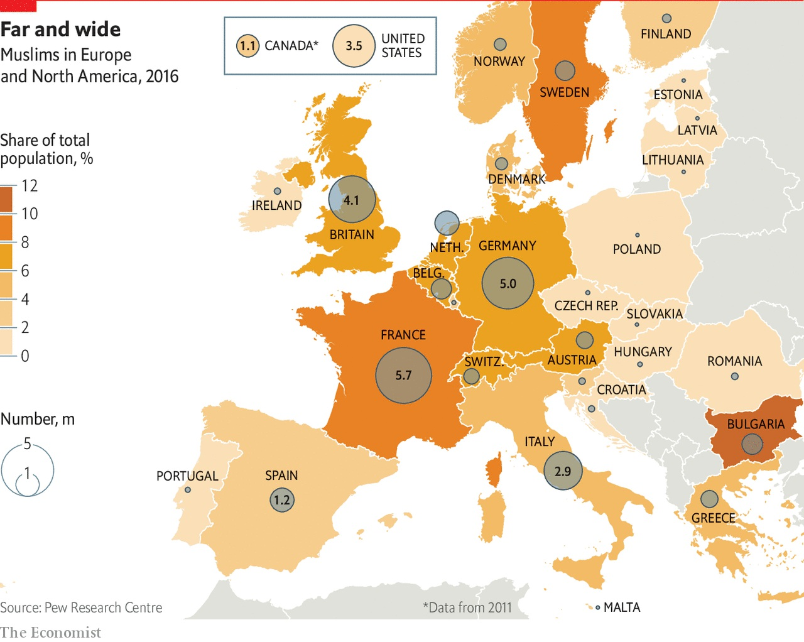
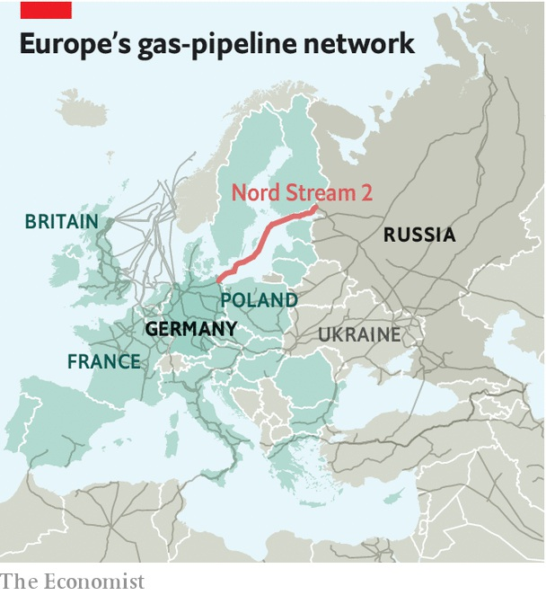
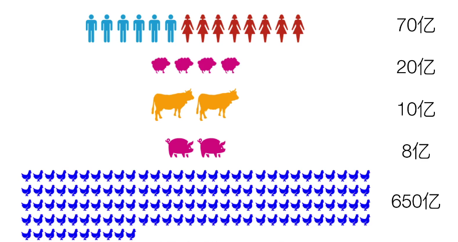

<link type="text/css" rel="stylesheet" href="/css/style.css">

# 日常笔记
### OOP：面向对象编程
- 虽然在大规模的问题中（像高考分数分布）往往体现出正态分布，但是，我认为，我们不能在解决实际问题之前就先验的假定并认为其符合XX分布。我认为这正好是‘概率模型的最大问题’。
- 同样，我们也不能在解决问题之前就假定并认为可以用OOP建模。我认为OOP思想来源于自然界的动植物分类以及以对象的方式进行抽象。问题在于：动植物分类手册可以只有分析，而没有综合。而我们的软件系统必然包含{分析，综合}两种方法。类别之间可以没有交互吗？可以的话我们就可以不用联系的观点看问题了。
- 编程的真正难点在于：抽象化。原因：抽象的的概念往往与显而易见的实际大相径庭。人本身很难进行大规模的抽象化{记忆力和计算力的缺陷：这样看人类确实是感性动物}。
- 真正驱动语言发展的关键是什么？简单性+性能
	- C++，java，python，ruby：库越來越强大，代码量越來越小。
	- C，C++，julia，rust：没有对象的C，复杂的C++，没有冗余的rust。有的都是性能优势。
- 复杂性原则：我们没有办法让一个复杂问题变简单，因为我们不能改变问题的复杂度，除了偷换问题。但我们可以把复杂的问题带给我们的困扰降低，至少在一定的时间内降低（摊平）。
- 库和框架的区别：库是一堆工具。框架是一架机器。
- 编程真正的要害在于：抽象+封装
- 正则表达式在处理**结构化文本**时，用起来很方便：URL，HTML，。。。
- 
### other
- 书本解决不了发展中国家的问题
- 人们面临的两难困境

- 程度越大,矛盾越深

- 欧洲对能源的依赖

- 文明的说话,委婉的语气

- 结果的重要性  

- 资源的消耗:   

- 弗如凝滞:   

---