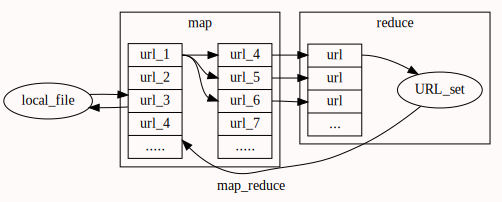

# 代码片段

### 多级链接跳转
-  结构示意图

- 代码：
```julia
import Base.Iterators.Stateful
import Base.Filesystem.filesize
import Base.Filesystem.walkdir
import Base.Filesystem.rm
using Logging
#=========================================
网页内容:分类提取：
	类别：超链接，文本，图像，其他
	class:1」    2」    3」       4」
======================================#
function get_context_from_html!(file_name,url_list,Pattern,class=1)
  #file|iostream => link_list
  #change place ： url_list
  	tmp=""
  try
	for line in eachline(file_name)
		if occursin(Pattern,line)
			m=match(Pattern,line)
		  	tmp=m.match
		    if class==1 && length(tmp)>10
		    	#push!(url_list,tmp[7:end-1])
		    	#StringIndexError :变长编码索引困难
		    	push!(url_list,tmp[7:prevind(tmp,lastindex(tmp))])
		    elseif class==2 
		    	push!(url_list,tmp)  #暂时如此
		    elseif class==3 && length(tmp) > 50
		    	push!(url_list,tmp[2:prevind(tmp,lastindex(tmp))])
		    end
			#println(m.match) #查看匹配的内容
		end
	end
  catch e
	println(tmp,length(tmp))
	throw(e)
  end
	return url_list
end
#==================================
	构建网络上的多级链接跳转
		1、map func：link in array-> 文件buffer ->links
		2、reduce func: links-> set ->add_to(array)
===============================#
function from_link2links!(url)
	fileName="tmp.txt" #下载的html文件缓存
#正则表达式模式定义
	#Pattern=r""  #匹配<a></a>
	#Pattern=r">[^<a-zA-Z]+?[^>]<"  #文本
	Pattern=r"href=\"https?.+?\""  #匹配  href=“http ：”
	new_urls=Set{String}()
#download使用curl
  try
	run(`curl -g -f --retry 0 -m 10 -o $fileName $url`)#每次写入自动覆盖原有文件内容
  	#download 无法设置-m 10 ；无法链接的google要等5min
  	#修改Base.download：没用 -y 10
  catch e
  	@error "错误为：$e "
  end
	get_context_from_html!(fileName,new_urls,Pattern)
	return new_urls
end
function check_url(url)
	#进一步处理url
	
end
function build_htmlSet(dir_name="htmlfile/")
  	result_file="link_palace.txt"  #link 存储位置
	URL_list=Array{String,1}()
	URL_set=Set{String}() #link集合
	
	for line in eachline(result_file)
		push!(URL_list,line)
		push!(URL_set,line)
		@info line  #从本地文件中初始化URL列表
	end
@label start	
	urls_set_list=map(from_link2links!,URL_list )
	URL_list=Array{String,1}()
	for u_set in urls_set_list
		for url in u_set
		#reduce url:检测url的质量
			#check_url(url)
		#url -> set
			if url ∉ URL_set
				push!(URL_set,url)
				push!(URL_list,url)
			end
		end
	end
	
	@info "URL_set的大小为：$(length(URL_set) )"
	@info "URL_list的大小为： $(length(URL_list))"
	@info "URL_list的随机元素：$(rand(URL_list) )"
	flush(io)
	if (length(URL_set)<10_0000) && (length(URL_list) > 0)
	#结束条件：URL_list为空，或者链接集合达到1k
		@goto start 
	end
	
  @info "结果存入文件"
	open(result_file,"w") do io
  		for node in URL_set
  			write(io,node*'\n')
  		end
	end
  @info "deal_html runing is end! $count"
  
end
#可用stdout 重定向改变输出到文件 ，但对@info等的输出无效
#io = open("log.txt", "w+") redirect_stdout(io)
io = open("log.txt", "w+")
logger = SimpleLogger(io)
global_logger(logger)
@time build_htmlSet()
flush(io)
close(io)
```
### 
```
```