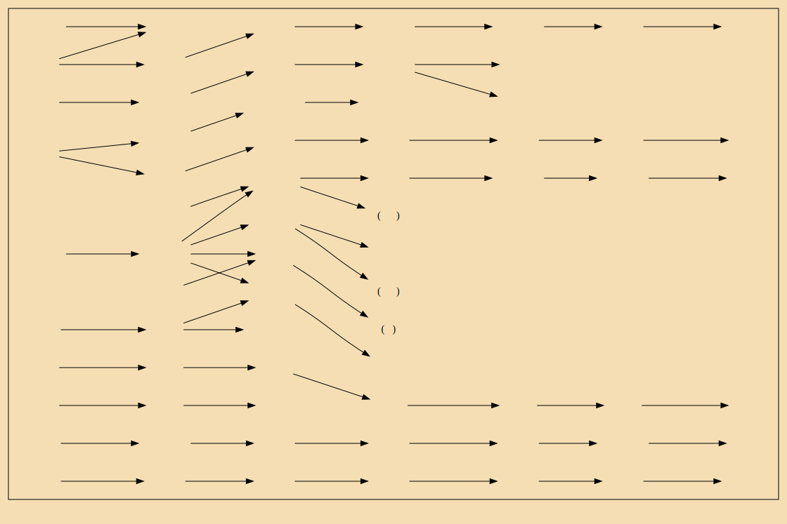

### 晋世家

- 天子无戏言。言则史书之，礼成之，乐歌之
- 靖侯十七年，周厉王迷惑暴虐，国人作乱，厉王出奔于彘，大臣行政，故曰“**共和**”
- 士蔿说(献)公曰：“故晋之群公子多，不诛，乱且起
- 晋欲伐虢，士蔿曰：“且待其乱
- 修己而不责人，则免於难
- 公曰：“寡人有子，未知其太子谁立。”里克不对而退
- 初，献公使士蔿为二公子筑蒲、屈城，弗就。夷吾以告公，公怒士蔿。士蔿谢曰：“边城少寇，安用之？”退而歌曰：“狐裘蒙茸，一国三公，吾谁適从！”卒就城。及申生死，二子亦归保其城
- 晋灭虢，虢公丑奔周。还，袭灭虞，虏虞公及其大夫井伯百里奚以媵秦穆姬
- 里克对曰：“不有所废，君何以兴？欲诛之，其无辞乎？乃言为此！臣闻命矣。”遂伏剑而死
- 重耳谓其妻曰：“待我二十五年不来，乃嫁。”其妻笑曰：“犁二十五年，吾冢上柏大矣。**虽然，妾待子**。”重耳居狄凡十二年而去

>至齐，齐桓公厚礼，而以宗女妻之，有马二十乘，重耳安之。重耳至齐二岁而桓公卒，会竖刀等为内乱，齐孝公之立，诸侯兵数至。留齐凡五岁。重耳爱齐女，毋去心。赵衰、咎犯乃於桑下谋行。齐女侍者在桑上闻之，以告其主。其主乃杀侍者，劝重耳趣行。重耳曰：“**人生安乐，孰知其他**！必死於此，不能去。”齐女曰：“子一国公子，穷而来此，数士者以子为命。子不疾反国，报劳臣，而怀女德，窃为子羞之。且不求，何时得功？”乃与赵衰等谋，醉重耳，载以行。行远而觉，重耳大怒，引戈欲杀咎犯。咎犯曰：“杀臣成子，偃之原也。”重耳曰：“事不成，我食舅氏之肉。”咎犯曰：“事不成，犯肉腥臊，何足食！”乃止，遂行。

- 成王曰：“晋公子贤而困於外久，从者皆**国器**，此天所置，庸可杀乎？
- 重耳出亡凡十九岁而得入，时年**六十二**矣，晋人多附焉。
- 重耳曰：“若反国，所不与子犯共者，河伯视之！”乃投璧河中，以与子犯盟。是时**介子推**从，在船中，乃笑曰：“天实开公子，而子犯以为己功而要市於君，固足羞也。吾不忍与同位。”乃自隐渡河
- 秦缪公诱吕、郤等，杀之河上，晋国复而文公得归。夏，迎夫人於秦，秦所与文公妻者卒为夫人。秦送三千人为卫，以备晋乱。
- 窃人之财，犹曰是盗，况贪天之功以为己力乎？
- 言，身之文也；身欲隐，安用文之？文之，是求显也
- 立善则固，事长则顺，奉爱则孝，结旧好则安
- (晋景公)八年，使郤克於齐。齐顷公母从楼上观而笑之。所以然者，郤克偻(驼背)，而鲁使蹇(跛脚)，卫使眇(一眼瞎)，故齐亦令人如之以导客
- 嬖(bi4)
- 郤至曰：“信不反君，智不害民，勇不作乱。失此三者，谁与我？我死耳！
- 十五年，悼公问治国於师旷。师旷曰：“惟仁义为本。”冬，悼公卒
- (晋平公)十四年，吴延陵季子来使，与赵文子、韩宣子、魏献子语，曰：“晋国之政，卒归此三家矣
- (定公)二十二年，晋败范、中行氏，二子(中行寅、范吉射)奔齐。
- 哀公四年，赵襄子、韩康子、魏桓子共杀知伯，尽并其地
- 悼公以後日衰，六卿专权。故君道之御其臣下。固不易哉
- (定公)十二年，孔子相鲁,三十三年，孔子卒

### 楚世家

###越王勾践世家

### 郑世家

### 赵世家

### 魏世家

###韩世家

### 田敬仲完世家

###孔子世家

###楚元王世家

### 荆燕世家

###齐悼惠王世家

###萧相国世家

### 曹相国世家

### 陈丞相世家

###绛侯周勃世家

### 梁孝王世家

### 三王世家

---

 右侧 

PDF换页
