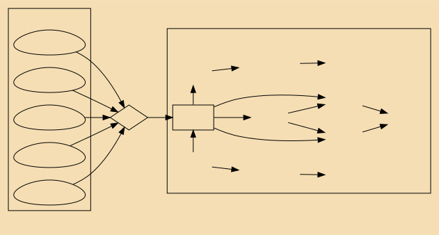
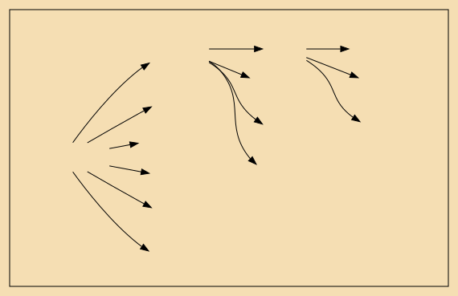

 
  
# 资本论 政治经济学批判
### 第二卷 
##资本的流通过程

  
卡尔$\cdot$马克思 著 
 恩格斯 编

  

## 序言
- 留下的**修订稿很多**,多半带有片断性质
- 材料的主要部分,虽然在实质上已经大体完成,但是在文字上没有经过推敲,使用的是马克思写摘要时惯用的语句:不讲究文体,有**随便**的、往往是粗鲁而诙谐的措辞和用语,夹杂英法两种文字的术语,常常出现整句甚至整页的英文。这是按照作者当时头脑中发挥的思想的原样写下来的
- 社会资本的再生产和流通,在马克思看来,非重写不可。以适应作者已经扩大的眼界
- 马克思多次对我说过,《资本论》第二卷和第三卷是献给他的夫人的

唯心论则是将上图中的箭头反向,认识过程是一个双向的过程
$$存在\longleftrightarrow 意识$$

# 第一篇： 资本形态变化及其循环
## 第一章： 货币资本的循环
- 资本的循环过程：
	- 第一阶段：货币转化成商品：G-W{gold - wood？}
	- 第二阶段：资本完成生产过程
	- 第三阶段：商品转化成货币：W-G
- 货币资本循环的公式：表示再生产
$$G-W \cdot \cdot \cdot P \cdot \cdot \cdot W'- G'$$
- 劳动力的价值或价格,是以工资的形式,即作为一个包含剩余劳动的劳动量的价格,支付给把劳动力当作商品出卖的劳动力所有者的
- 货币资本和生产资本的互相转化
- 简单商品流通的一般形式：货币只是充当转瞬即逝的流通手段,只是充当商品和商品进行交换的媒介物
$$W-G-W$$
- 这种不合理在于:作为价值形成要素的劳动本身不能具有价值,从而,一定量劳动也不能具有在它的价格上,在它和一定量货币的等价上表现出来的价值
- 劳动力一经出卖而和生产资料相结合,它就同生产资料一样,成了它的买者的生产资本的一个组成部分
- 这是买和卖,是货币关系,但这种买和卖的前提是:买者是资本家,卖者是雇佣工人。 而这种关系所以会发生,是因为劳动力实现的条件—— 生活资料和生产资料—— 已经作为别人的财产而和劳动力的所有者相分离了
- 只有在资本主义生产的基础上**,商品生产**才表现为标准的、占统治地位的生产形式
- 资本主义的方式进行生产,必须经常备有专供支付工资用的货币
- 资本主义生产不仅生产商品和剩余价值;它还再生产并且以越来越大的规模再生产雇佣工人阶级,把绝大多数直接生产者变为雇佣工人
- 雇佣工人只能靠出卖劳动力来过活？
- **时候一到, 玫瑰花自然可以摘到**
- 劳动,只能在劳动过程中实现
- , 因为工人不是资本家的奴隶, 并且资本家买到的仅仅是在一定时间内对他的劳动力的使用
- 雇佣工人只能靠出卖劳动力来过活。劳动力的维持,要求每天进行消费
- 资本主义的商品生产越发展, 它对主要是直接满足自己需要而只把多余产品转化为商品的任何一种旧生产形式, 就越发生破坏和解体的作用。 它使产品的出售成为人们关心的主要事情,{消费主义}
- 不论生产的社会形式如何, 劳动者和生产资料始终是生产的因素,凡要进行生产, 就必须使它们结合起来
>任何商品生产的经营都同时成为剥削劳动力的经营;但是,只有资本主义的商品生产, 才成为一个**划时代**的剥削方式, 这种剥削方式在它的历史发展中, 由于劳动过程的组织和技术的巨大成就,使社会的整个经济结构发生变革, 并且不可比拟地超越了以前的一切时期
- G 已经不再是单纯的货币,而是明显地成了货币资本, 它表现为一个已经自行增殖的价值
- 价值的各部分本身是没有质的区别的, 除非它们表现为不同物品即具体物的价值
- 在货币上, 商品的一切差别都消灭了, 因为货币正是一切商品的共同的等价形式
- 作为一个已经增殖的价值的表现,和W′是同G′一个东西, 表现着同一个东西,只是形式不同而已
- **货币资本的循环**, 资本的循环过程是流通和生产的统一
- 资本主义生产的动机就是赚钱。 生产过程只是为了赚钱而不可缺少的中间环节,只是为了赚钱而必须干的倒霉事。 {因此, 一切资本主义生产方式的国家, 都周期地患一种狂想病, 企图不用生产过程作媒介而赚到钱。
## 第二章 生产资本的循环
- 真正的流通,只是表现为周期更新的和通过更新而连续进行的**再生产**的媒介
- 总流通表现的形式{$W-G-W$}和它在货币资本循环中具有的形式{$G-W-G$}相反
- 流通中断的货币就处在贮藏货币的形式上{消费是分散的}
- 全部过程的目的,发财致富 ( 价值增殖)
- 货币资本不论是充当单纯的流通手段, 还是充当支付手段, 它的职能只是充当媒介
- 劳动生产率的不断变动是资本主义生产的特征,因此,价值比例的不断变动,正好是资本主义生产的固有现象
- 资本价值抛弃这种形式,是为了再取得这种形式{得到了却不满足的原因？}
> 商品的一大部分只是表面上进入消费,实际上是堆积在转卖者的手中没有卖掉,事实上仍然留在市场上。这时, 商品的潮流一浪一浪涌来, 最后终于发现,以前涌入的潮流只是表面上被消费吞没。商品资本在市场上互相争夺位置。后涌入的商品,为了卖掉只好降低价格出售。 以前涌入的商品还没有变成现金, 支付期限却已经到来。 商品持有者不得不宣告无力支付, 或者为了支付不得不给价就卖。 这种出售同需求的实际状况绝对无关。同它有关的,只是支付的需求,只是把商品转化为货币的绝对必要。于是危机爆发了{原因是信息传导不畅？}
- 货币资本停留在货币状态中, 都是运动中断的结果
- 资本主义生产的全部性质,是由预付资本价值的增殖决定的
- 积累或规模扩大的生产,是剩余价值生产不断扩大, 从而资本家发财致富的手段,是资本家的个人目的, 并且包含在资本主义生产的一般趋势中
- 他的资本的不断增大, 成为保存他的资本的条件
- 实际上, 剩余价值在正常情况下总要有一部分作为收入花掉, 另一部分则资本化

## 第三章 商品资本的循环
- 商品资本循环的总公式是:
$$  W'-G'-W....P....W'	$$

## 第四章 循环过程的三个公式
- (1)$G-W...P...W'-G'$
- (2)P...Ck...P
- (3)Ck...P(W')
- 每一个因素都表现为出发点、经过点和复归点。 总过程表现为生产过程和流通过程的统一; 生产过程成为流通过程的媒介, 反之亦然
- 所有这三个循环都有一个共同点: 价值增殖是决定目的,是动机
- P... P循环不仅表现为生产资本的周期更新,而且在流通过程完成以前, 同样表现为它的职能即生产过程的中断
- 正常的生产过程就越是屈服于不正常的投机
- 资本主义生产方式以大规模的生产为前提, 同样也必须以大规模的出售为前提
- 因为劳动力固然是工人的商品, 但只有卖给了资本家, 才变为资本
- 所谓信用经济本身只是货币经济的一种形式, 因为这两个名词都表示生产者自身间的交易职能或交易方式
- 在资产阶级眼界内, 满脑袋都是生意经
- 资本家以货币形式投入流通的价值, 小于他从流通中取出的价值
- 实际上必定是 “贱买贵卖”
- 他之所以**卖得贵**,不是因为他的商品高于它的价值出售,而是因为所卖商品的价值大于它的生产组成部分的价值总额。
- 只要假定动机不是发财致富本身,而是享受,资本主义就从根本上被废除了
- 资本家随着货币的积累, 把货币作为有息的活期存款存入银行, 这就是属于信用范围的问题
## 第五章 流通时间
- 资本在生产领域停留的时间是它的生产时间
-  资本在流通领域停留的时间是它的流通时间
-  无论在哪一种情况下, 生产资料都不起劳动吸收器的作用
-  商品转化为货币在这里同时就是包含在商品中的剩余价值的实现
-  流通时间和生产时间是互相排斥的
-  流通时间越等于零或近于零, 资本的职能就越大, 资本的生产效率就越高, 它的自行增殖就越大
-  周转时间包含生产时间或再生产时间
-  一种商品越容易变坏, 它的物理性能对于它作为商品的流通时间的绝对限制越大, 它就越不适于成为资本主义生产的对象

## 第六章 流通费用
- 生意人碰在一起, 就象 “ 希腊人遇到希腊人就发生激战 ” 一样
- 第三者当然不是因为爱上资本家的美丽的眼睛而让他们支配自己的劳动力
- 使别人为自己劳动的资本家
- 当独立的**小商品生产者**把他们的一部分时间耗费在买卖上的时候, 这种时间或者在他们的生产职能的间歇期间耗费的时间, 或者是他们的生产时间的损失
- 劳动时间除了耗费在实际的买卖上外, 还耗费在簿记上
- 无论是在生产领域还是在流通领域的两个阶段, 首先只是以计算货币的形态, 观念地存在于商品生产者或资本主义商品生产者的头脑中
- , 簿记越是转化为社会的簿记, 这种费用也就越少。{银行业务}
- 不管一种产品是不是作为商品生产的, 它总是财富的物质形式,是要进入个人消费或生产消费的使用价值
- 作为商品, 它的价值观念地存在于价格中, 这个价格丝毫不改变它的现实使用形式
- 在资本主义生产的基础上, 商品成为产品的一般形式, 绝大部分产品是作为商品生产的, 从而必须取得货币形式
- 一切追加价值的劳动也会追加剩余价值, 并且在资本主义基础上总要追加剩余价值
- 保险公司把单个资本家的损失在资本家阶级中间分配。 尽管如此, 就社会总资本考察, 这样平均化的损失仍然是损失。
- 在产品作为商品资本存在或停留在市场上时，产品形成商品储备
- 要求一定量商品 ( 生产资料)不断处在市场上, 也就是形成储备{什么是市场？所有处在可交易状态的thing、place}
- 工人必须在市场上找到
- 它只是商品,不过是作为资本价值存在形式的商品
- , 社会上绝大部分人变为雇佣工人, 他们靠挣一文吃一文过活
- 储备越是社会地集中, 这些费用相对地就越少
- 不管产品储备的社会形式如何, 保管这种储备, 总是需要费用
- 非自愿储备是由流通停滞造成的
- 一切只是由商品的形式转化而产生的流通费用, 都不会把价值追加到商品上
- A 卖给B的房屋,是作为商品流通的, 但是它并没有移动
- 物品的使用价值只是在物品的消费中实现
- 一切产品的绝大多数转化为商品, 其次又因为远方的市场代替了当地的市场
- 商品在空间上的流通, 即实际的移动, 就是商品的运输。它又具有如下的特征: 它表现为生产过程在流通过程内的继续, 并且为了流通过程而继续。
# 第二篇 资本周转

## 七、周转时间和周转次数
## 八、固定资本和流动资本
## 九、预付资本的总周转，周转的周期
## 十、重农学派&&亚当&#183;斯密
## 十一、李嘉图
## 十二、劳动期间
## 十三、生产时间
## 十四、流通时间
## 十五、周转时间对预付资本量的影响
## 十六、可变资本的周转
## 十七、剩余价值的流通
# 第三篇 社会总资本的再生产和流通
## 十八、导言
## 十九、前人阐述
## 二十、简单再生产
## 二十一、积累和扩大再生产
## 二十二、卷二 注释

---
##问题&&想法

- 
- 生产力进步并不是齐头并进,而是参差不起.想农业,纺织业...
- 
- **资本究竟是什么？** {购买力？劳动力占有？}
- 马克思认为经济危机的原因是： **生产过剩**
	- 许小年认为原因是：央行不恰当的**货币政策**
	- 还有中说法是: **两极分化**
	- 本人则觉得是： **恶性竞争**,依据
		- 危机是一个恶性循环，因此危机爆发的原因一定在这个环上
			- 环：银行资金紧张->企业负债->个人消费下降->银行...
		- 1825金本位时期应该**没有**央行货币政策的影响(除非硬说,金银的稀缺性导致长期紧缩)
		- 2001年阿根廷,洗劫中产,两极分化排除{数据待查}
		- 1988年,中国倒爷盛行,不存在生产过剩
	- 灵感来源:众狗抢食;
- 供给垄断(供需:1对多)->价格高;
- 需求垄断(供需:多对1)->价格低;
- 供需平衡(供需:多对多)->价格稳定

##卷一的注释
- 《资本论》 是马克思的主要著作。马克思写这部著作花费了四十年的时间, 从四十年代初起直到他逝世。
- 1843年底, 马克思在巴黎开始系统地研究政治经济学
- 他深刻而全面地研究了国民经济史和各国特别是英国当时的经济
- 在这一时期, 他感兴趣的
有土地所有制的历史和**地租**理论、 货币流通和**价格**的历史与理论、 **经济危机**、 **技术史**和**工艺史**以及**农艺学**和农业化学的问题
- 古希腊哲学家伊壁鸠鲁认为有无数的世界。 这些世界是按照它们本身的自然规律产生和存在的。 神虽然存在, 但存在于世界之外, 存在于世界之间的空隙中,对宇宙的发展和人的生活没有任何影响
- 1347 年至1350 年西欧鼠疫流行。 根据现有资料, 当时死于鼠疫的约有二千五百万人, 占西欧总人口的四分之一
- “危险在于迟缓”
- “确实什么也没有学到”
- 傅立叶把工厂叫做 “温和的监狱”
- 好 话能遮丑
- 规定即否定

---
 
# 百年中国,一波四折
温铁军
 
 

- 社会化大生产+财产私人占有=>资本阶段
- 对资源短缺的人口大国而言,任何**成本**大于**收益**的制度安排都会引发社会动荡甚至革命
- 对本民族进行剥夺的内向型积累方式:**现代化,工业化**
- 四次工业化:
	- 洋务运动
	- 民国初年:黄金十年; 抗战之后:官僚,买办资本主义
	- 新中国:中国政府主导的国家工业化
	- 改革开放:地方政府主导的地方工业化
- 工业化都必须搞资本原始积累
- 矛盾总是往后积累给了后人
- 必须在公平竞争条件下,才有效的市场经济机制
- 任何类型的国家资本都趋向于追去垄断占有超额利润
- 瓜分资源和市场为目的的两次世界大战
- 工商业者规避风险的主要方式"兼业"或"退出"
- 旧社会的主要矛盾不是地主过量剥夺农民,而是工商业和金融资本过度剥夺农村导致农民大量破产
- 金融垄断资本集团控制全球经济通过国际资本流动推动经济增长同时为产业升级进入以技术创新为主的知识经济时代开拓了宽广大道.且已经被证明是人类有史以来最先进的,具有普世性的制度
- 常识:资本不能产生利润
- 即便是泡沫经济,**金融资本利润**仍然只能从大多数制造业为主的国家的实质经济中掠取
- 无论是革命还是改革,往往都是逼出来的,都没有约定或实现设计好,批准了在干的.
- 理论界强调的"效益"和大众追求的"均平"之间越来越难以调和
- 只有泡沫经济才能提供的超额利润
-  农村**留守儿童**问题
- 只有调整现存利益分配机制才是真改革
- 利益集团{教育,医疗,医药,工业,金融,法律,广电,地产,互联网,军工,科研}
- 利益分配机制固化：导致条块分割，尾大不掉
---
- 浸淫于殖民化体系中的发展中国家所谓学术界得 数典忘祖
- 警语：
	- 如果金融资本为主的所谓服务业占GDP超过50%，势必因金融异化于实体而内生性的爆发危机
	- 如果真实城市化率超过50%中国就将不会再有城市资本危机代价向农村转嫁而实现软着陆的基础
- 2007年中国股灾蒸发掉7万亿人民币的市值；
- 中国不分属性的资本巨婴们完全按照西方经济学教科书出牌
- 2015年股市危机销掉21万亿人民币，接着汇市危机销掉一万多亿美元外储
- 新时代乡村振兴战略的最实际作用，是与激进全球化生发出的“灰犀牛”们赛跑
- 只要过剩资本还能找到投资空间，则新世纪资本高速扩张造成的严重过剩矛盾就会缓解
- “懒政怠政”的官员；研究部门中的两面人
- 现今城市化发展也可以归纳为“**空间平移，集中贫困**”这八个字，涌现出大量“蚁族”、“工蜂族”打工者，这当中既有初级劳动力，也不乏脑力劳动者
- 

###完